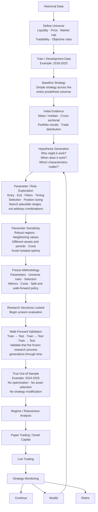
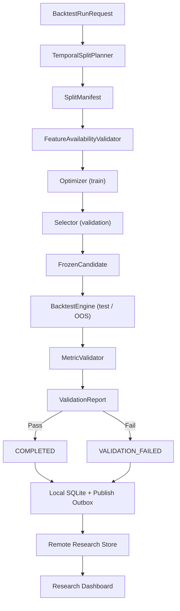

# Backtest Pipeline Reliability and Research Storage Plan

**Date:** September 9, 2026  
**Status:** In implementation — see [§18 Execution Status](#18-execution-status)  
**Scope:** Backtest validation, time-series splitting, look-ahead controls,
out-of-sample evaluation, and consolidated research storage

## Table of Contents

- [1. Objective](#1-objective)
- [2. Current Architecture and Gaps](#2-current-architecture-and-gaps)
  - [Existing capabilities](#existing-capabilities)
  - [Gaps to close](#gaps-to-close)
- [3. Proposed Target Architecture](#3-proposed-target-architecture)
  - [Generalized strategy research lifecycle](#generalized-strategy-research-lifecycle)
  - [Technical execution architecture](#technical-execution-architecture)
- [4. Consolidated Research Storage](#4-consolidated-research-storage)
  - [Decision](#decision)
  - [Local SQLite responsibilities](#local-sqlite-responsibilities)
  - [Remote store and synchronization](#remote-store-and-synchronization)
  - [Run identity and reproducibility](#run-identity-and-reproducibility)
  - [Immutability and append-only semantics](#immutability-and-append-only-semantics)
  - [Proposed schema](#proposed-schema)
  - [Retention profiles](#retention-profiles)
  - [Artifact policy](#artifact-policy)
  - [Migration and compatibility](#migration-and-compatibility)
  - [Legacy record contamination](#legacy-record-contamination)
- [5. Research Review Dashboard](#5-research-review-dashboard)
  - [Local SQLite viewer](#local-sqlite-viewer)
  - [Shared remote dashboard](#shared-remote-dashboard)
  - [Initial views](#initial-views)
  - [Security and sharing](#security-and-sharing)
- [6. Execution Model Honesty](#6-execution-model-honesty)
  - [E1. Intrabar exit ordering](#e1-intrabar-exit-ordering)
  - [E2. Gap-through fills](#e2-gap-through-fills)
  - [E3. Undeclared leverage and unbounded cash](#e3-undeclared-leverage-and-unbounded-cash)
  - [E4. No cost model on the exit side](#e4-no-cost-model-on-the-exit-side)
  - [E5. Execution model versioning](#e5-execution-model-versioning)
- [7. Metric Sanity Gates](#7-metric-sanity-gates)
  - [Metric definition normalization (prerequisite)](#metric-definition-normalization-prerequisite)
  - [Validation categories](#validation-categories)
  - [Where each gate applies](#where-each-gate-applies)
  - [Corrections to specific proposed gates](#corrections-to-specific-proposed-gates)
  - [Run evidence record](#run-evidence-record)
  - [Metric contract](#metric-contract)
  - [Lifecycle](#lifecycle)
- [8. Reliable Train, Validation, and Test Splitting](#8-reliable-train-validation-and-test-splitting)
  - [Universe definition and survivorship](#universe-definition-and-survivorship)
  - [What multi-symbol actually requires](#what-multi-symbol-actually-requires)
  - [Definitions](#definitions)
  - [Split contract](#split-contract)
  - [Purge and embargo](#purge-and-embargo)
  - [Default split profile](#default-split-profile)
- [9. Look-Ahead Bias Prevention and Validation](#9-look-ahead-bias-prevention-and-validation)
  - [Prevention contract](#prevention-contract)
  - [Automated checks](#automated-checks)
- [10. Out-of-Sample and Walk-Forward Evaluation](#10-out-of-sample-and-walk-forward-evaluation)
  - [Final holdout](#final-holdout)
  - [Nested walk-forward](#nested-walk-forward)
- [11. Failure and Recovery Paths](#11-failure-and-recovery-paths)
- [12. Test Fixtures for Dangerous Failure Modes](#12-test-fixtures-for-dangerous-failure-modes)
- [13. Incremental Implementation Plan](#13-incremental-implementation-plan)
  - [Parallel lanes](#parallel-lanes)
  - [Minimum bar before trusting a result](#minimum-bar-before-trusting-a-result)
- [14. Initial Acceptance Criteria](#14-initial-acceptance-criteria)
- [15. Resolved Decisions](#15-resolved-decisions)
- [16. Remaining Open Items](#16-remaining-open-items)
- [17. Design Review Log](#17-design-review-log)
- [18. Execution Status](#18-execution-status)
  - [Status at a glance](#status-at-a-glance)
  - [Increment status](#increment-status)
  - [Partial increments: what is missing](#partial-increments-what-is-missing)
  - [Unplanned work](#unplanned-work)
  - [Findings that change the plan](#findings-that-change-the-plan)
  - [Recommended next increment](#recommended-next-increment)

## 1. Objective

Build a backtest pipeline that refuses to promote untrustworthy results. A run
is complete only when:

1. its inputs and time splits are reproducible;
2. all features and decisions are causal at the decision timestamp;
3. performance metrics pass mathematical and strategy-specific sanity checks;
4. parameter selection is separated from final out-of-sample evaluation; and
5. the run, its validation evidence, and its lineage are persisted without
   producing one metadata file per experiment or artifact.

This work extends the existing backtester, optimization pipeline, walk-forward
analysis, and research journal rather than creating a second parallel framework.

## 2. Current Architecture and Gaps

### Existing capabilities

- `BacktestEngine` produces trades, equity curves, and `BacktestResult`.
- `OptimizationPipeline` performs parameter sweeps, scoring, robustness checks,
  walk-forward analysis, and optional research-journal registration.
- `WalkForwardEngine` creates rolling train/test periods.
- `ResearchRegistry` tracks hypotheses, experiments, lineage, execution
  metadata, conclusions, and artifact references.
- Research-journal domain models already use Pydantic validation and immutable
  terminal experiment states.
- Existing validation guidance documents expected ORB ranges and simulator
  invariants in `docs/backtester-mvp/validate-backtester-pipeline.md`.

### Gaps to close

- A parameter sweep writes one YAML experiment file per variation.
- Artifact references also write one YAML file per artifact.
- Querying requires scanning and deserializing all experiment files.
- Sequential ID generation scans directories and is unsafe under concurrent
  writers.
- `COMPLETED` currently means results exist, not that their metrics are valid.
- Metric contracts are not centralized or enforced before completion.
- Current walk-forward periods use approximate 30-day months and do not model
  purge or embargo boundaries.
- Walk-forward analysis evaluates a fixed ruleset in each window; it does not
  optimize on each training window and then freeze the selected parameters for
  its test window.
- Feature availability and look-ahead checks are documented but are not a
  pipeline-wide contract.
- The distinction between validation data and a final untouched out-of-sample
  test is not enforced.

## 3. Proposed Target Architecture

### Generalized strategy research lifecycle

ORB is the first concrete strategy, but the pipeline stages and contracts must
remain strategy-agnostic. Strategy-specific behavior belongs in rulesets,
parameter definitions, metric profiles, and feature declarations.



Freezing applies to the research process, not one parameter value selected
inside each walk-forward fold. Walk-forward validation may reject the frozen
methodology. If its results motivate a methodological change, that change starts
a new research lineage and must be frozen before validation is rerun.

The `Modify` path likewise starts a new research lineage. It must not
retroactively change or relabel the frozen methodology or its true OOS result.

### Technical execution architecture

Use explicit interfaces so the reliability features can be implemented and
tested independently:



The orchestration layer owns state transitions. Individual validators return
structured findings and do not write files or mutate experiment state.

## 4. Consolidated Research Storage

### Decision

Replace YAML-per-record persistence with a hybrid local/remote store:

- **Local SQLite** is the durable execution store and publish outbox.
- **Supabase PostgreSQL** is the shared remote source of truth and dashboard read
  model.
- **`ResearchStore` interfaces** keep pipeline logic independent of either
  backend.

This follows the repository's existing operational-dashboard architecture:
local writes remain reliable when the network is unavailable, then an outbox
publisher idempotently upserts records to Supabase.

Recommended runtime layout:

```text
%LOCALAPPDATA%\strategy-lab\research.sqlite3   # Local runtime store and outbox

research/
├── hypotheses/             # Legacy YAML during migration only
├── experiments/            # Legacy YAML during migration only
└── artifacts/              # Legacy references during migration only
```

The database path must resolve from an environment variable defaulting **outside
the repository**. This repository lives under a OneDrive-synced directory, so a
database at `research/research.sqlite3` would be continuously synced — exactly
what the next paragraph forbids. `.gitignore` currently covers `*.db`,
`*.db-shm`, and `*.db-wal` but **not** `*.sqlite3`; add `*.sqlite3*` before any
database is created.

Neither the live SQLite file nor database exports should be merged through Git
or synchronized through OneDrive, Dropbox, or similar file-sync tools. Syncing
an open SQLite file can corrupt it or create conflicting database copies.

Git tracks:

- schema and migrations;
- repository code and rulesets;
- curated Markdown research summaries;
- optional deterministic export commands and formats.

This avoids binary merge conflicts when implementation is split across
worktrees. Each test or development worktree uses its own temporary database.
All devices publish to and review the same remote project.

### Local SQLite responsibilities

- One file replaces dozens or thousands of YAML metadata files.
- Transactions make experiment creation, completion, ID allocation, and
  artifact registration atomic.
- Foreign keys preserve hypothesis, experiment, split, and artifact lineage.
- Indexed queries replace full-directory scans.
- JSON columns can preserve flexible Pydantic payloads without prematurely
  normalizing every strategy parameter.
- No new runtime dependency is required.
- Structured metric and parameter data can be queried directly, allowing plots
  and reports to be regenerated instead of stored as permanent artifacts.

### Remote store and synchronization

Supabase is preferred over introducing another remote database provider because
the repository already contains:

- a Supabase REST publishing destination;
- a durable local publish outbox with retries and dead-letter handling;
- a browser-safe anonymous read pattern protected by row-level security; and
- a static Next.js dashboard with a Supabase data adapter.

Research storage differs from the operational dashboard in one important way:
the dashboard app is read-only, but the research pipeline must **write** to
Supabase. That write path mirrors the live trading bot, which already publishes
with service-role credentials from trusted Python code.

| Component | Supabase access | Credential |
| --- | --- | --- |
| Research publisher (Python, local machine) | Insert/upsert research rows | Service-role key from environment or local secret file |
| Research dashboard (browser, GitHub Pages) | Read only | Anonymous key plus row-level security |
| Operational dashboard (browser) | Read only | Existing anonymous key |

Credential rules:

- Store the service-role key only in local environment configuration; never in
  Git, the Next.js app, or any `NEXT_PUBLIC_*` variable.
- Grant browser roles select-only policies on research tables.
- Write policies must reject anonymous-role inserts, updates, and deletes.
- Rotate the key if it is ever used outside trusted local tooling.
- Keep research write credentials separate from operational trading credentials
  so a research tool cannot modify live trading tables.

Synchronization rules:

- Generate globally unique run/event IDs locally; do not allocate sequential IDs
  by scanning files or relying on a device-local counter.
- Include stable idempotency keys on all published records.
- Commit a completed run and its outbox events in the same local transaction.
  Note that this **deviates** from the live trading bot, whose outbox lives in a
  separate database file and therefore has no transactional guarantee. The
  research outbox table must live in the same file as `experiments`, or the
  atomicity claim is false in implementation.
- The idempotency key must be the run ID, not a natural key such as
  `(metric_name, timestamp)` as used operationally, which would collide across
  runs.
- Upsert remote rows by stable ID and schema version.
- Publish parent records before dependent rows, or use deferred remote
  transactions.
- Retry transient failures with bounded backoff and dead-letter permanent
  failures.
- Store `origin_device_id`, code commit, ruleset version, dataset fingerprint,
  and timestamps for auditability.
- Reconcile local and remote counts/checksums after each publish batch.
- Treat remote rows for completed and failed runs as append-only.

The remote store is the cross-device source of truth. Local SQLite databases are
device-specific caches and durable queues, not peer databases that merge with
one another.

DuckDB remains a possible future analytics read model, but it should not be the
transactional registry.

### Run identity and reproducibility

Run identity is the contract every other artifact derives from: the idempotency
key, the sweep cache key, the manifest hash, the publish key, and the
reproducibility claim. It must be settled before any other work starts.

```text
run_fingerprint = H(
    ruleset_canonical_json,      # content, not filename
    dataset_fingerprint,
    split_manifest_hash,
    code_commit,
    feature_set_version,
    metric_calculation_version,
    execution_model_version,
    random_seed,
)
```

The existing sweep cache is a live reproducibility hazard:
`ParameterSweep._cache_key` (`analysis/parameter_sweep.py:216-246`) hashes the
ruleset **filename**, symbol, dates, swept parameters, capital, and slippage. It
does not hash ruleset content, feature or indicator code, the execution model,
or the git commit. Editing a non-swept field in a ruleset, or fixing a bug in
the ORB calculator, silently reuses stale cached results. The sweep cache key
must become exactly the run fingerprint.

Additional identity rules:

- Run IDs are UUIDv7 or ULID, generated locally. `EXP-NNN` survives only as a
  display alias assigned at import time, never allocated at runtime. This is
  what retires the directory-scanning `_next_id` in `registry.py`.
- Record `origin_device_id` and a branch/worktree label on every run.
- Refuse to persist `COMPLETED` when the working tree is dirty unless an
  explicit `allow_dirty` flag is recorded on the run. At least one existing
  experiment carries `git_dirty: true` and is therefore not reproducible.
- Re-running the same configuration creates a new run ID with a `supersedes`
  link, so re-runs are visible rather than silently overwriting.

### Immutability and append-only semantics

Today immutability is enforced by `chmod 0o444` plus an
`object.__setattr__(self, "_completing", True)` guard, and status updates delete
and rewrite the file. In SQLite the equivalent mechanism is `BEFORE UPDATE` and
`BEFORE DELETE` triggers on rows in terminal states, plus an append-only
`experiment_state_transitions` table. Specify this in the contracts stage or the
Python workaround will simply be ported.

`REVIEW_REQUIRED` resolution must not mutate a published run row. Model
resolutions as append-only `run_reviews` rows with a derived current status,
which keeps the "completed and failed rows are append-only" rule intact.

### Proposed schema

| Table | Purpose |
| --- | --- |
| `schema_migrations` | Applied schema versions |
| `hypotheses` | Hypothesis lifecycle and rationale |
| `experiments` | Run identity, configuration, status, lineage, and conclusion |
| `experiment_tags` | Searchable many-to-many tags |
| `metric_values` | Named metric values with units and calculation version |
| `metric_validations` | Expected bounds, observed values, severity, and findings |
| `split_manifests` | Train/validation/test boundaries and purge/embargo policy |
| `walk_forward_folds` | Per-fold boundaries, selected parameters, and results |
| `feature_availability` | Feature causality classification and availability rule |
| `lookahead_validations` | Leakage test evidence and failures |
| `trades` | Local-only trade rows; written only under a debug retention profile |
| `equity_points` | Local-only equity/drawdown series; written only under a debug retention profile |
| `artifact_references` | Checksums and locations for irreducible external artifacts |
| `research_notes` | Notes linked to experiments |
| `run_evidence` | Reconciliation aggregates and ledger checksums; written under every retention profile |
| `run_reviews` | Append-only `REVIEW_REQUIRED` resolutions |
| `experiment_state_transitions` | Append-only lifecycle history |
| `oos_access_log` | Append-only record of every final-holdout unlock |
| `rejected_ideas` | Rejected hypotheses and supporting experiment IDs |
| `publish_outbox` | Idempotent local-to-remote synchronization events |
| `publish_dead_letters` | Failed events requiring operator review |

Store configurations, flexible result summaries, and execution metadata as
canonical JSON where relational filtering is not required. Normalize fields
that require indexing, constraints, aggregation, or foreign keys.

### Retention profiles

**Decision:** parameters and metrics are the durable record. Trade-level and
equity-level rows are debugging data, are never published to Supabase, and are
written locally only when explicitly enabled.

Every run declares one retention profile:

| Profile | Stores | Publishes to Supabase | Use |
| --- | --- | --- | --- |
| `summary` (default) | Configuration, parameters, split manifest, aggregate metrics, validation findings, lineage | Yes | All normal runs and parameter sweeps |
| `diagnostic` | `summary` plus locally retained trades | No trade rows | Investigating suspicious or failed metrics |
| `full` | `summary` plus locally retained trades and equity points | No trade or equity rows | Pipeline/step tuning and metric-calculation development |

Rules:

- The default for every run, sweep row, and walk-forward fold is `summary`.
- `diagnostic` and `full` are opt-in through an explicit run flag or
  configuration field, never implicitly by strategy or environment.
- Metric validation failures may automatically suggest, but must not silently
  enable, a higher profile; re-running under `diagnostic`/`full` is an explicit
  troubleshooting action.
- The publisher must refuse to send `trades` and `equity_points` rows regardless
  of profile, so remote storage stays small and shareable.
- Locally retained debug rows are prunable by age, run status, and profile
  without affecting the durable parameter/metric record.
- Because debug rows are disposable, reproducibility comes from the stored
  configuration, dataset fingerprint, split manifest, and code commit — a run
  must be re-executable from those alone.

### Artifact policy

Default to storing data, not rendered files:

- Store sweep rows, metrics, and validation findings in SQLite; store trades and
  equity points only under a debug retention profile.
- Generate CSV, JSON, Markdown, HTML, and plots on demand.
- Persist an artifact only when it cannot be reproduced cheaply or is needed as
  immutable external evidence.
- Store only its relative URI, SHA-256 checksum, size, media type, and owning
  experiment in `artifact_references`.
- Do not store absolute workstation paths.

For unusually large trade or market-derived datasets, add a later
content-addressed Parquet backend behind the same `ResearchStore` interface.
That optimization is not required for the initial migration.

### Migration and compatibility

1. Introduce a `ResearchStore` protocol without changing public registry use.
2. Implement `SQLiteResearchStore`.
3. Define the remote schema and implement `SupabaseResearchPublisher`.
4. Adapt `ResearchRegistry`, query, lineage, artifact tracking, and backtest
   integrations to use the protocol.
5. Add an idempotent importer for existing `HYP-*`, `EXP-*`, `NOTE-*`,
   `RJ-*`, and `ART-*` records.
6. Verify imported row counts, IDs, relationships, terminal states, and
   canonical payload hashes.
7. Backfill and reconcile the remote store from the imported local database.
8. Keep YAML reads available during one compatibility period, and dual-write new
   runs to both stores for that period so the system is never in an ambiguous
   state.
9. Stop creating new per-record YAML after migration acceptance.
10. Archive or remove legacy YAML only through a separately reviewed change.

### Legacy record contamination

Existing walk-forward results are methodologically contaminated:
`OptimizationPipeline.optimize` sweeps the full date range, takes the top row,
then runs walk-forward **over that same range** with the winner. Any stored
walk-forward score is in-sample with respect to the parameter choice.

The importer must therefore stamp every legacy record with
`methodology_version = "legacy-uncontrolled"`, and both dashboards must visually
segregate legacy records from records produced by the new pipeline. Importing
these numbers unlabeled beside clean results would launder them.

The importer must also handle two known data-contract violations rather than
silently dropping them:

- `Experiment.artifacts` is documented as a list of `ART-NNN` IDs, but at least
  one record stores absolute Windows paths. Normalize to repository-relative
  where the file is under the repository, otherwise record an `external_uri`
  with a null path.
- Records with `git_dirty: true` must be imported with that flag as a
  first-class column, since they are not reproducible.

## 5. Research Review Dashboard

Provide two review surfaces over the same research schema:

1. a fast, dependency-light local viewer for the current device's SQLite data;
2. a shared remote page for Supabase data in the existing operational dashboard.

### Local SQLite viewer

Create a small loopback-only viewer such as:

```text
tools/backtest-research-viewer/
├── server.mjs             # Read-only SQLite queries and local HTTP server
└── public/
    ├── index.html
    ├── app.mjs
    └── styles.css
```

Example command:

```powershell
node tools\backtest-research-viewer\server.mjs `
  --db research\research.sqlite3
```

The MJS server should:

- use the pinned Node runtime's built-in SQLite support;
- open the database in read-only mode;
- bind to `127.0.0.1` by default and reject non-loopback access;
- expose a small set of parameterized, paginated JSON endpoints;
- serve plain HTML/CSS/MJS with no build step;
- display the same core run, metric, split, validation, walk-forward, trade,
  equity, and sync-health views as the remote dashboard where practical;
- refresh on demand so newly committed local runs appear immediately;
- show clearly that data is local and whether each run has published remotely;
- never expose arbitrary SQL execution in the browser.

The browser does not open or upload the SQLite file. `server.mjs` owns database
access and returns only the requested view data. Pin the minimum Node version
before implementation so `node:sqlite` behavior is consistent across devices.

### Shared remote dashboard

Add a statically exported `/research` route to
`apps/operational-metrics-dashboard` instead of creating a separately deployed
application:

```text
apps/operational-metrics-dashboard/src/
├── app/
│   ├── page.tsx                    # Existing live/operations dashboard
│   └── research/
│       └── page.tsx                # Shared backtest research dashboard
├── components/
│   ├── DashboardApp.tsx
│   └── research/
└── data/
    ├── supabaseAdapter.ts          # Existing operational read model
    └── researchSupabaseAdapter.ts  # Research read model
```

The existing GitHub Pages workflow uploads one static `out` directory. Next.js
static export can include both `/` and `/research` in that same artifact, so
both dashboard surfaces share one repository Pages site, deployment, theme,
navigation, and browser-safe Supabase configuration.

Building a second app is technically possible by copying two independent build
outputs into different subdirectories before `upload-pages-artifact`, but it
adds duplicated dependencies, navigation, styling, and deployment logic without
a clear benefit.

The shared app should have top-level **Live Trading** and **Backtest Research**
navigation. The existing live dashboard's internal Live, Charts, Operations,
and Performance views remain scoped to the Live Trading section.

Remote dashboard data adapters:

- `supabaseAdapter`: default shared remote view with browser-safe credentials and
  read-only row-level security;
- `apiAdapter`: optional authenticated REST API for queries too complex to
  expose directly;
- `fixtureAdapter`: deterministic development and UI-test datasets;
- `snapshotAdapter`: optional read-only exported JSON bundle for remote UI
  development and tests.

### Initial views

| View | Purpose | Availability |
| --- | --- | --- |
| Research overview | Run counts, lifecycle status, validation failures, recent activity | Local + remote |
| Experiment explorer | Filter by strategy, hypothesis, universe, period, tags, status, commit, and device | Local + remote |
| Run detail | Configuration, dataset fingerprint, split manifest, metrics, findings, and lineage | Local + remote |
| Metric validation | Observed values against hard bounds and plausibility profiles with remediation | Local + remote |
| Parameter surface | Heatmaps, neighboring values, plateaus, cliffs, and selected candidate | Local + remote |
| Walk-forward/OOS | Fold timeline, train/validation/test results, degradation, and fold-level metrics | Local + remote |
| Look-ahead audit | Feature availability declarations and leakage-test evidence | Local + remote |
| Universe analysis | Member list, `universe_type`, survivorship badge, per-symbol and pooled cross-sectional results with dispersion. Liquidity/price/market-cap screening rules appear only once `point_in_time_screened` is supported. | Local + remote (ships with P5b) |
| Sync health | Device origin, publish status, reconciliation, and remotely reported dead letters | Local + remote |
| Equity and drawdown | Capital curve, drawdown, and returns | Local only, debug profile |
| Trade distribution | P&L/R histograms, tails, exits, holding time, symbol, and regime breakdown | Local only, debug profile |

Because trades and equity points are never published, the remote dashboard shows
aggregate metrics only. Trade-level inspection happens on the device that ran the
backtest, through the local viewer, and only when a debug retention profile was
enabled.

### Security and sharing

- Require user authentication for non-public research.
- Use least-privilege read policies scoped to the project/user.
- Keep service-role and write credentials server-side.
- Restrict CORS to deployed dashboard origins.
- Paginate and aggregate server-side; do not download all trades or equity rows
  on initial page load.
- Support stable, shareable URLs for a hypothesis, experiment, fold, or
  validation finding.
- Record dashboard schema/API versions so old runs remain reviewable.

## 6. Execution Model Honesty

Metric gates cannot rescue a dishonest simulator. Rigorous splits layered over an
optimistic fill model produce precisely-quantified wrong answers. A code audit
during design review found three defects in the current engine that no gate in
this plan would have caught, plus one metric-definition problem that would make
the gates themselves misfire.

These must be fixed before any new research numbers are generated, because
fixing them changes every existing result.

### E1. Intrabar exit ordering

`PortfolioManager.check_exits` (`vibe/backtester/core/portfolio.py:149-184`)
evaluates take-profit before stop-loss using intrabar `bar.high` / `bar.low`.
Any bar whose range contains both levels is therefore always booked as a
take-profit. This is a systematic optimistic bias that inflates win rate, and it
is invisible to prefix-invariance and every other look-ahead check in §9,
because the bar is genuinely in the past.

The docstring at `portfolio.py:134` states that "bar.close must cross the level
(not intrabar wick)", while the code uses the wick. The documented and actual
execution models disagree, so no currently stored result can be interpreted with
confidence.

Required:

- an `intrabar_resolution` run parameter, defaulting to pessimistic (stop
  resolves first when both levels are touched in one bar);
- published `ambiguous_exit_count` and `ambiguous_exit_rate` metrics;
- a `REVIEW_REQUIRED` finding when the ambiguous rate is material;
- correct the docstring to match the implemented model.

### E2. Gap-through fills

Exits fill at exactly `pos.stop_price` or `pos.take_profit`
(`portfolio.py:156-183`) even when the bar opened beyond the level. A stop at 99
on a bar that opens at 95 fills at 99 today.

Required:

- invariant: every trade's `exit_price` lies within `[bar.low, bar.high]` of its
  exit bar;
- when the bar opened past the level, the fill must be at `bar.open` or worse;
- published `gap_through_fill_count`.

### E3. Undeclared leverage and unbounded cash

`BacktestEngine._position_size` (`engine.py:372-381`) returns
`risk_dollars / stop_distance` with no buying-power check, and
`PortfolioManager.open_position` (`portfolio.py:55-58`) moves cash with no bound.
With a 1% risk budget and a tight opening range, position notional routinely
exceeds several times account equity. A strategy that is only profitable at
undeclared leverage is not the strategy being tested.

Required:

- `max_leverage` as a declared run parameter;
- hard invariants: `cash >= -declared_margin` at every bar, and
  `gross_notional / equity <= max_leverage`;
- published `max_observed_leverage` and `min_cash` metrics.

### E4. No cost model on the exit side

`FillResult` is constructed with `commission=0.0` (`engine.py:307`), nothing
applies commission anywhere, and slippage is applied only at entry through the
ORB price override (`engine.py:239-246`). Stop, take-profit, and end-of-day
exits fill at exact levels with no cost at all, so a slippage-monotonicity test
would only exercise one side of each round trip.

Required:

- a commission and exit-side slippage model;
- `total_costs` as a mandatory metric;
- invariant `gross_pnl - total_costs == net_pnl`;
- plausibility gate: `total_costs > 0` whenever `n_trades > 0`.

**Status.** Both halves are implemented. Commission lives in
`core/commission.py` and is charged at every fill site; exit slippage lives in
`core/exit_slippage.py` and is keyed on exit reason, because the three reasons
are different order types live (`STOP` a native `StopOrder` that becomes a
market order, `TP` a `LimitOrder` that cannot fill worse than its price, `EOD`
a market order). Charging a take-profit for slippage would be wrong rather than
conservative, so a liquidity-providing exit structurally cannot be assigned a
tick cost. R-multiples are rebased on net P&L, and the invariant is asserted on
both golden windows.

The two costs are reported separately and must not be added to the same
subtraction. A commission is an explicit debit and sits outside `gross_pnl`, so
`gross_pnl - total_costs == net_pnl` holds. Slippage is embedded in the fill
price and has *already* reduced `gross_pnl`, so it is published as
`exit_slippage_cost` in the diagnostics instead. Reporting only `total_costs`
would understate the true cost of trading by more than four times.

### E5. Execution model versioning

The plan versions metrics and split planners but not the execution model, even
though changing any of E1-E4 changes every result. Add
`execution_model_version` to the run fingerprint (§4) so results computed under
different execution assumptions are never compared silently.

## 7. Metric Sanity Gates

### Metric definition normalization (prerequisite)

The gates below must not be built on the current metric definitions, which are
mutually inconsistent. Normalizing them is a prerequisite increment, not a
detail:

| Problem | Location |
| --- | --- |
| `win_rate` counts `r <= 0` as a loss | `analysis/performance.py:151-153` |
| `losing_trades` counts `r < 0` | `analysis/parameter_sweep.py:69` |
| `n_trades` silently excludes trades with `initial_risk <= 0` | `analysis/performance.py:139` |
| `total_pnl` sums only those surviving trades | `analysis/performance.py:186` |
| `max_drawdown` is a negative fraction | `analysis/performance.py:233-234` |
| ...but is rendered as dollars in sweep output | `analysis/parameter_sweep.py:506` |
| Sharpe is per-bar `mean/std * sqrt(252*78)`, with 78 hardcoded for 5-minute bars | `analysis/performance.py:230` |

Because `win_rate` and `losing_trades` disagree on exactly-zero-R trades, the
"wins + losses = trades" gate fails spuriously; because `n_trades` drops trades,
P&L reconciliation fails with no stated cause. Every metric must declare a
`calculation_version`, and the current QQQ ORB result must be frozen as a golden
file before normalization so each change is explicit and reviewed.

### Validation categories

Metric checks must distinguish calculation correctness from strategy quality.

| Category | Example | Failure behavior |
| --- | --- | --- |
| Mathematical invariant | finite values; `0 <= win_rate <= 1`; no NaN/Inf in any published metric | Block completion |
| Cross-metric invariant | `n_trades == len(trades) == closed_position_count`; `dropped_trade_count == 0` | Block completion |
| Accounting reconciliation | `equity_final - initial_capital == sum(trade.pnl) - total_costs` when flat at end; per-fill cash delta equals `qty * price` plus the fill's commission; `sum(entry_qty) == sum(exit_qty)` per symbol; `gross_pnl - total_costs == net_pnl` | Block completion |
| Execution realism | `exit_price` within `[bar.low, bar.high]`; `cash >= -declared_margin`; `gross_notional / equity <= max_leverage`; no open positions at end of session for an intraday strategy | Block completion |
| Data integrity | expected vs observed session count; bars-per-session anomalies; duplicate or non-monotonic timestamps; `high < low`; zero or negative prices | Block completion |
| Dataset sufficiency | enough sessions and trades for requested analysis | Mark inconclusive |
| Strategy plausibility | ORB win rate near 25-45%; material `ambiguous_exit_rate` | Mark `REVIEW_REQUIRED` at candidate level; block promotion until reviewed |
| Research acceptance | minimum OOS expectancy or maximum drawdown | Record pass/fail but do not label a calculation bug |

The first five categories identify likely implementation defects. Research
acceptance criteria identify an unsuccessful strategy and must not be reported
as metric-calculation failures.

Note that `equity == cash + sum(position_mark_to_market)` is **not** a usable
invariant: `PortfolioManager.update_equity` (`portfolio.py:254-264`) computes
equity that way, so asserting it afterwards can never fail. The
reconciliation identities listed above are what actually catch the sign and
conservation bugs that check was intended to find.

Two of those identities are stated net of costs, which matters once E4 lands:
a cost model that debited cash without appearing in `total_costs` would satisfy
a gross-only identity while quietly losing money. Writing them net makes the
cost ledger and the cash ledger check each other.

### Where each gate applies

Applying plausibility profiles to every sweep row would be unworkable: a
200-row grid with 60 rows outside the plausible band would require 60 manual
resolutions before the optimizer could pick a candidate.

| Scope | Gates applied |
| --- | --- |
| Every run, including every sweep row and fold | Mathematical, cross-metric, accounting, execution realism, data integrity |
| Sweep as a whole | One aggregate finding, e.g. "38% of rows outside the plausible band" |
| Candidate and promotion level only | Strategy plausibility profiles, research acceptance |

### Corrections to specific proposed gates

| Proposed gate | Problem | Resolution |
| --- | --- | --- |
| `wins + losses = trades` | Tautological against `win_rate`; fails spuriously against `losing_trades` on any exactly-zero-R trade | Unify definitions first; then assert against the trade ledger, not between two derived metrics |
| `max_drawdown` bounds | Sign and unit ambiguous between modules | Declare sign and unit in the metric contract |
| `Sharpe > 2.5` | Current Sharpe is per-5-minute-bar annualized with a hardcoded 78, on a series that is flat overnight; not comparable to the daily Sharpe the threshold assumes | Compute from session returns before wiring the gate |
| ORB `win_rate` 25-45% | `CLAUDE_MEMORY.md` records 54.5% and 55.7% win rates for 10/15-minute ORB after the caching fix, so a naive band fires on known-good results. Win rate is a function of the take-profit multiple | Flag the combination `win_rate > 55% AND avg_win_r >= avg_loss_r`, or condition the band on exit configuration |
| Zero trades in a fold | Legitimate for a short window with restrictive filters | Always `INCONCLUSIVE`, never `VALIDATION_FAILED` |

### Run evidence record

Because trades and equity points are not retained by default (§4), the evidence
that reconciliation ran and passed must itself be durable. Every run persists a
`run_evidence` row under **every** retention profile, including `summary`, and
publishes it remotely:

```text
n_trades, n_closed_positions, dropped_trade_count,
sum_trade_pnl, gross_pnl, total_costs, equity_start, equity_end,
sum_abs_qty, min_cash, max_observed_leverage,
ambiguous_exit_count, gap_through_fill_count,
first_trade_ts, last_trade_ts,
n_sessions_expected, n_sessions_observed, n_bars,
trade_ledger_sha256, equity_curve_sha256
```

The two checksums are what make the reproducibility claim verifiable: re-run
from the run fingerprint, recompute the ledger hash, and compare. Without them,
"a run must be re-executable from stored configuration alone" is an assertion
that can never be tested. They also mean the `diagnostic` profile is needed only
for diagnosis, never for verification.

### Metric contract

Each metric definition should declare:

- stable metric name and calculation version;
- value type and unit;
- hard mathematical bounds;
- nullable/undefined conditions;
- dependencies used for reconciliation;
- optional profile-specific plausible range;
- numeric tolerance;
- severity and remediation text.

Example profiles:

- `universal`: mathematical and accounting invariants;
- `orb`: ORB-specific plausible ranges;
- `random_direction`: near-zero gross expectancy and negative net expectancy;
- `buy_and_hold`: reconciliation against deterministic benchmark data.

### Lifecycle

Add non-success terminal and blocking states:

```text
REGISTERED -> RUNNING -> VALIDATING -> COMPLETED
                             |-> REVIEW_REQUIRED -> COMPLETED
                             |                   \-> VALIDATION_FAILED
                             \-> VALIDATION_FAILED
RUNNING ------------------------> EXECUTION_FAILED
```

| State | Meaning | Effect |
| --- | --- | --- |
| `COMPLETED` | All invariants passed; metrics trustworthy | Eligible for selection and promotion |
| `REVIEW_REQUIRED` | Metrics are possible but implausible for the declared profile | Blocks selection and promotion until a human records a resolution |
| `VALIDATION_FAILED` | Hard invariant or accounting reconciliation failed | Treated as a calculation defect; never promoted |
| `EXECUTION_FAILED` | The run did not finish | Distinct from invalid results |

Resolving `REVIEW_REQUIRED` requires recording a reviewer, a resolution reason,
and any supporting evidence, then transitioning to `COMPLETED` or
`VALIDATION_FAILED`. Research acceptance failures (for example, weak OOS
expectancy) are valid `COMPLETED` runs that are simply not promoted.

`VALIDATION_FAILED` preserves the run and all diagnostics but prevents candidate
selection, promotion, and success reporting. `EXECUTION_FAILED` remains distinct
from invalid calculated results.

The validation report must include all findings in one pass so troubleshooting
does not require repeatedly fixing one error at a time.

## 8. Reliable Train, Validation, and Test Splitting

### Universe definition and survivorship

The lifecycle's `DEFINE UNIVERSE` stage covers two materially different things,
and conflating them is what creates survivorship bias. The plan supports both,
but requires each run to declare which one it used.

| Universe type | Meaning | Survivorship bias | Status |
| --- | --- | --- | --- |
| `single_symbol` | One instrument, e.g. QQQ | Not applicable | Supported today |
| `static_declared` | A fixed, hand-listed set of symbols chosen once and held constant across the whole study | **Present and bounded.** Every member is a company that still exists and still meets the bar today. Results are optimistic relative to a genuine historical screen. | Target for the first multi-symbol work |
| `point_in_time_screened` | Membership recomputed at each rebalance from objective liquidity, price, and market-cap rules | Absent, if and only if delisted names are present in the data | Blocked until point-in-time membership plus delisted history exists |

The local Parquet corpus is roughly 25 symbols over about eight years. That is
enough for `static_declared` cross-sectional and limited portfolio work, and it
is **not** enough for `point_in_time_screened`, because the set was chosen with
knowledge of which names survived.

Rules:

- Every run stamps `universe_type`, the sorted member list, and a
  `universe_hash`. The hash participates in the run fingerprint.
- Every run stamps `survivorship_bias: not_applicable | present | absent`.
  `static_declared` is always `present`. This is surfaced as a visible badge in
  both dashboards, exactly like `legacy-uncontrolled`.
- The planner rejects `point_in_time_screened` until delisted history is
  available. It does **not** reject multi-symbol runs.
- A `static_declared` result may not be described as evidence that the strategy
  works "across the market". It is evidence that it worked across a set selected
  in hindsight, which is a weaker and still useful claim.

### What multi-symbol actually requires

Cross-sectional analysis, running the same strategy independently per symbol and
aggregating, is a modest change: loop the existing single-symbol engine and pool
the results. Portfolio analysis is not, because it introduces capital contention
that the current engine cannot represent.

| Capability | Requirement | Current state |
| --- | --- | --- |
| Cross-sectional evidence | Run per symbol, aggregate mean/median/dispersion, report per-symbol and pooled metrics separately | Achievable by looping `BacktestEngine` |
| Shared timeline | Merge bars from N symbols into one chronologically ordered event stream, with per-symbol session alignment and halt/missing-bar handling | Not implemented. `BacktestEngine.run` is single-symbol by construction |
| Capital contention | When more signals fire than capital supports, a deterministic, declared, causal ranking rule decides which are taken | Not implemented, and a leakage surface: the ranking rule may not use same-bar or future information |
| Correlated risk | Cap simultaneous exposure and report realized concentration | Not implemented |
| Honest leverage | Buying-power checks per E3 | Not implemented, and materially worse in a universe: 25 symbols firing at the same opening-range breakout with no cash bound produces fantasy leverage |

Two consequences for sequencing:

- Cross-sectional aggregation is cheap and can land early.
- Portfolio simulation must land **after** E3, because without a buying-power
  bound a portfolio backtest is not merely inaccurate, it is meaningless.
- Pooled metrics must never be presented without dispersion. A strategy that
  works on three of twenty-five names has a good pooled mean and no edge.

### Definitions

- **Train:** fit or optimize parameters.
- **Validation:** compare trained candidates and select one configuration.
- **Test/OOS:** evaluate the frozen selection on data that has never influenced
  fitting, selection, thresholds, or implementation decisions.

A test set is out-of-sample only while it remains untouched. Repeatedly checking
it during development turns it into another validation set.

**Development data vs the final holdout.** These are two different things and
the plan uses both, so the boundary must be stated explicitly:

```text
DEV       = train + validation + ALL walk-forward folds   (may be revisited)
FINAL_OOS = contiguous, later, disjoint from DEV          (touched once, ever)
```

Walk-forward folds live entirely inside `DEV`. This matters because rejecting a
frozen methodology at the walk-forward stage starts a new research lineage,
which means walk-forward windows *will* be consulted repeatedly across lineages.
That is acceptable only because they are development data. The final holdout is
the only period that carries the untouched guarantee.

Within `DEV`, candidate selection uses a dedicated validation window separate
from the training window (see "Default split profile"). Selecting on a tail of
the training history is a different design with different contamination
properties and is not used.

**Session:** one session is one regular-hours trading day for the instrument's
exchange, identified by its exchange-local calendar date. Half days count as one
session; weekends and exchange holidays are not sessions. All split lengths,
purge intervals, embargo intervals, and warmup requirements are counted in
sessions, never in calendar days or approximate 30-day months.

Session enumeration must come from a real exchange calendar
(`pandas_market_calendars` is already a dependency) and must be reconciled
against the bars actually present in the dataset. "Missing or duplicated
sessions" means *a calendar session with no bars*, not merely a duplicate index
entry — resampling with `dropna()` makes data holes invisible otherwise.

### Split contract

`TemporalSplitPlanner` should produce an immutable `SplitManifest` containing:

- dataset identity and content fingerprint;
- exchange timezone and trading calendar;
- inclusive/exclusive boundary semantics;
- train, validation, and test session IDs;
- purge interval;
- embargo interval;
- lookback and label horizons;
- random seed if any stochastic sampling is used;
- planner version and canonical manifest hash.

Use exchange sessions rather than approximate `30 * months` arithmetic. Reject:

- overlapping split membership;
- missing or duplicated sessions;
- insufficient warmup history;
- test sessions used by the optimizer or selector;
- boundaries that violate configured purge or embargo requirements.

### Purge and embargo

Each serves a distinct purpose and each must be **derived and recorded**, not
asserted:

- **Purge** = the strategy's maximum label/outcome horizon in sessions. It
  removes observations whose outcome crosses into the next split. For a strategy
  that is always flat by the end of the session, no outcome can straddle a
  boundary and the derived purge is **0**.
- **Embargo** = a function of serial correlation between adjacent per-session
  returns. It is not an overnight-gap argument. For a same-session-flat strategy
  it is near zero.
- **Warmup** = the maximum indicator lookback. It is a *context* requirement,
  not a leakage requirement, and must never be conflated with purge.

The planner records the derivation and its inputs in the split manifest, so a
reviewer can see why a given purge or embargo was chosen rather than trusting a
default.

A note on rolling features: a causal rolling transform such as a trailing
252-session percentile rank is legitimately shared across folds. The dangerous
class is a *fitted* transform — a full-sample z-score, a cross-sectional rank, or
a percentile fitted over the entire range. The feature registry must enumerate
which existing features fall in each class and lock that classification in a
test.

### Default split profile

Split geometry is strategy-specific, so the planner derives minimum purge,
embargo, and warmup requirements from each strategy's declared holding period,
label horizon, and longest indicator lookback. Profiles supply the defaults; the
planner rejects any profile that violates a declared requirement.

Initial ORB profile (intraday, positions closed by end of day):

| Setting | Default | Rationale |
| --- | --- | --- |
| Train window | 24 months of sessions | Spans multiple volatility regimes without over-weighting stale behavior |
| Validation window | 6 months of sessions | Enough trades to compare candidates without consuming the final holdout |
| Walk-forward test window | 3 months of sessions | Balances fold count against per-fold sample size |
| Step | 3 months of sessions | Equals the test window, so test windows never overlap |
| Purge | 1 session | ORB trades close intraday, so only the boundary session's outcome can straddle a split |
| Embargo | 1 session | Guards against overnight-gap and carryover effects near the boundary |
| Feature warmup | Longest declared indicator lookback (context-only) | ATR/ADR/relative-volume features need history before the first tradable session |
| Final OOS | Contiguous, untouched, after all walk-forward research | The only unbiased estimate of the frozen methodology |

Notes:

- Longer-horizon or multi-day strategies must increase purge and embargo to at
  least their label horizon; one session is an ORB-specific default, not a
  framework default.
- Warmup sessions are context-only: they may feed indicators but must never
  produce trades, labels, or scored metrics.
- Portfolio- or universe-level features (liquidity screens, market-cap ranks,
  cross-sectional ranks) must respect the same purge and embargo boundaries as
  instrument-level features.
- If total available history cannot satisfy train, validation, walk-forward, and
  a final holdout, the planner fails loudly rather than silently shrinking the
  out-of-sample period.

## 9. Look-Ahead Bias Prevention and Validation

### Prevention contract

Every candidate feature must declare:

- `causal` or `diagnostic`;
- source timestamp;
- availability timestamp;
- decision timestamp rule;
- required lookback;
- whether revisions are possible.

Only causal features with `availability_time <= decision_time` may enter signal,
filter, sizing, execution, or parameter-selection logic.

This formalizes the existing repository rule that full-day or later-bar
information cannot be used for earlier entries.

### Automated checks

1. **Prefix invariance:** changing bars after time `t` cannot alter features,
   signals, orders, or fills at or before `t`.
2. **Future perturbation:** replace future values with extreme values and assert
   that prior decisions remain identical.
3. **Truncation equivalence:** a run truncated at `t` must match the prefix of a
   full run through `t`.
4. **Feature availability audit:** reject causal features whose availability
   rule resolves after the decision time.
5. **ORB boundary fixture:** assert the breakout bar does not contribute to the
   opening range against which it is tested.
6. **Split contamination audit:** assert test metrics and test-derived features
   are absent from optimization and selection inputs, naming the specific
   overlapping session when it fails.

**These checks must execute through the research path, not just the engine.**
Features are precomputed once over the whole date range by
`ParameterSweep._precompute_features` and sliced per fold afterwards, so a
truncation-equivalence test that only exercises `BacktestEngine.run` will pass
while the research path leaks. Running the leakage suite with
`use_precomputed_features=True` through `ParameterSweep` is an explicit
deliverable, and a prerequisite for walk-forward work.

The feature registry must also classify every existing feature as causal or
diagnostic and lock that classification in a test, so a future fitted transform
cannot be added silently.

Store each check's version, input fingerprint, status, and evidence in
`lookahead_validations`.

## 10. Out-of-Sample and Walk-Forward Evaluation

Implement two complementary modes:

### Final holdout

Optimize on train, select on validation, freeze the candidate, and evaluate once
on the final test/OOS period. This is the strongest final estimate and should be
required before promotion.

#### Enforcing "untouched"

Asserting that the holdout is untouched is not a mechanism. A manifest audit is
trivially bypassed by any script that calls the engine with explicit dates, which
is how all current scripts work. Make it a property of the system:

1. Commit the final-OOS date range to a hash-locked configuration file **before**
   further research, so the range cannot be chosen after seeing results.
2. The data loader refuses to return bars after `dev_end` without an explicit
   unlock token.
3. Every unlock appends a row to `oos_access_log` recording who, when, why, and
   the run ID.
4. Promotion is blocked when a research lineage's holdout touch count exceeds
   one, and the dashboard surfaces the counter.

#### Pre-registered acceptance rule

Before the holdout is unlocked, the run must record the metric, the threshold,
and the minimum trade count that will constitute success. With a handful of
folds and expectancy in the 0.05-0.25R range, the standard error is wide enough
that a threshold chosen afterwards is indistinguishable from selecting the
answer.

### Nested walk-forward

For each fold:

1. optimize parameters only on that fold's training sessions;
2. select on that fold's validation window;
3. freeze the selected parameters;
4. evaluate on the next unseen test window;
5. advance by exchange sessions;
6. concatenate non-overlapping OOS results for aggregate metrics.

The current `WalkForwardEngine` must be upgraded because it evaluates one fixed
ruleset across train and test periods rather than re-optimizing within each
training fold. This is a control-flow inversion of the existing pipeline rather
than an adaptation of it, and should be split into a pure optimizer/selector
seam, a fold driver, and a stitching layer.

#### Selection discipline

Taking the top row of a sweep is an argmax over the whole grid; with hundreds of
rows the winner is largely selection noise. The selector contract must:

- record `n_candidates_evaluated` on every run;
- select a robust neighborhood centroid rather than a bare argmax;
- record the selection margin over the runner-up.

#### Fold failure semantics

A failed or invalid fold makes the entire walk-forward **inconclusive**. Surviving
folds must not be stitched, because that is survivorship selection among folds.
Note that the existing sweep swallows exceptions and continues, silently
producing grids with holes; the fold driver must not inherit this behavior.
Enforce `n_folds_expected == n_folds_completed` as a hard invariant.

Report both per-fold and stitched-OOS metrics. Never aggregate overlapping test
windows as though they were independent observations.

## 11. Failure and Recovery Paths

| Scenario | Handling |
| --- | --- |
| Backtest crashes mid-run | A crashed process cannot write its own failure state. Use a lease/heartbeat on `RUNNING` rows plus a startup sweep that marks stale leases `EXECUTION_FAILED`. |
| Validation fails | `VALIDATION_FAILED` with the full one-pass finding set retained. |
| Supabase unavailable | The outbox absorbs it. Surface `pending_events_older_than(24h)` as a headline dashboard number, not only inside a sync view. |
| Stale outbox records | Claim/retry guarded to `pending` and `failed` states only. |
| Result published twice | Idempotent upsert keyed on run ID. |
| Same configuration re-run | New run ID with a `supersedes` link; never a silent overwrite. |
| Schema, strategy, dataset, or parameter change | All change the run fingerprint, which invalidates cached results and makes the difference visible. |
| A walk-forward fold fails | Whole walk-forward is inconclusive; no partial stitching. |
| One fold produces invalid metrics | Same as above; per-fold findings roll up to the parent. |
| Final OOS accidentally accessed | Loader guard plus append-only access log; promotion blocked on repeat access. |
| Dashboard unavailable | The local viewer provides full review of local data. |
| Local SQLite inconsistent | `PRAGMA integrity_check` on open, plus a documented rebuild-from-remote path. Note that a rebuild recovers parameters and metrics only, since trades and equity are never published. |

## 12. Test Fixtures for Dangerous Failure Modes

Small synthetic fixtures, each targeting a specific way the pipeline can produce
a confident wrong answer.

| ID | Fixture | Guards |
| --- | --- | --- |
| F1 | A feature defined as `close.shift(-1)` but declared causal | Availability audit and future-perturbation checks |
| F2 | Truncation equivalence run **through `ParameterSweep`** with precomputed features: sessions 1-10 vs 1-5 must produce identical trades in 1-5 | Full-sample feature transforms |
| F3 | Contiguous run of sessions 21-60 vs segment 21-60 with 20 warmup sessions; trades must be identical, warmup sessions must produce none and appear in no denominator | Warmup correctness (E-series, §8) |
| F4 | A strategy declaring a 2-session label horizon with a position held overnight into the test window | Purge derivation; no double counting |
| F5 | One bar where `low <= stop` and `high >= take_profit` | Intrabar resolution (E1); fails against current code |
| F6 | Long entry 100, stop 99, next bar opens 95 | Gap-through fills (E2); fails against current code |
| F7 | A duplicated fill and a partial exit fill | Quantity and cash conservation |
| F8 | Tight opening range producing very large share count against a declared `max_leverage` | Leverage ceiling (E3); demonstrates the current defect in one test |
| F9 | A manifest whose test sessions overlap the optimizer's set by exactly one session; plus a loader request past `dev_end` without an unlock token | Contamination audit and holdout lock |
| F10 | Same run at zero and non-zero commission | Cost model and `gross - costs == net` |
| F11 | Import all existing YAML records into a temporary database | Per-record canonical hash parity, absolute artifact paths preserved, terminal states preserved |
| F12 | A destination failing N times then succeeding; plus a publisher handed a `trades` event | Exactly-once upsert, ordering, dead-letter, and the no-trades guarantee |
| F13 | Freeze the current QQQ ORB result as a golden file **before** metric normalization | Makes every metric change explicit rather than silent |

## 13. Incremental Implementation Plan

The ordering principle: **make the simulator honest before making the research
process rigorous, and make both correct before investing in distribution.**
Rigorous splits over an optimistic fill model produce precisely-quantified wrong
answers, so execution realism and metric normalization move to the front.
Storage, remote sync, and the shared dashboard are real goals but contribute
nothing to trustworthiness, so they move later and run in a parallel lane.

Every increment below leaves the system runnable and is independently mergeable.

| # | Increment | Goal | Prereqs | Key scope | Tests |
| --- | --- | --- | --- | --- | --- |
| P0 | Contracts and identity | One definition of run identity, states, and interfaces | — | Lifecycle enum; `RunFingerprint`; `SplitManifest`, `MetricDefinition`, `ValidationFinding`, `RunEvidence`, `FeatureDeclaration`; canonical JSON hashing; `ResearchStore` protocol; DB path outside OneDrive; `.gitignore` for `*.sqlite3*` | Hash determinism and canonical ordering |
| P1 | Metric normalization | Metrics mean exactly one thing | P0 | Unify win/loss definitions, units, dropped-trade accounting, session-based Sharpe; add `calculation_version` | Per-metric unit tests; F13 golden file |
| P2 | Execution realism and accounting | The simulator stops flattering itself | P1 | E1-E4; `RunEvidence` including both checksums, computed under every profile | F5, F6, F7, F8, F10; the three reconciliation identities |
| P3 | Session calendar and manifest planner | Splits stop being approximate | P0 | Exchange calendar; session enumeration reconciled against actual bars; purge/embargo/warmup derived from declared horizons; manifest hash; rejection rules | Boundary, overlap, missing-session, determinism; F4 |
| P4 | Warmup-aware segment execution | Folds become comparable to each other | P3 | `run_segment(segment, warmup_sessions)`; indicators primed on warmup; trading suppressed and metrics scoped during warmup | F3 |
| P5 | Feature declarations and leakage harness | Leakage caught on the path research actually uses | P4 | Feature registry with causal/diagnostic classification; leakage suite executed through `ParameterSweep` with precomputed features; ORB boundary fixture; contamination audit | F1, F2 |
| P5b | Cross-sectional universe | Evidence across symbols, not just QQQ | P4 | `universe_type`, member list, `universe_hash`, `survivorship_bias` stamped on every run; loop the single-symbol engine over members; pooled **and** per-symbol metrics with dispersion; reject `point_in_time_screened` | Determinism over member order; dispersion reported; survivorship badge propagates to both dashboards |
| P6 | Validation gates and lifecycle | Bad metrics cannot reach `COMPLETED` | P1, P2, P5 | `MetricValidator`; profiles; one-pass findings; plausibility scoped to candidate level; `EXECUTION_FAILED` via stale-lease sweep | Synthetic pass/fail per category; zero-trades-is-inconclusive |
| P7 | SQLite store and importer | One file replaces the YAML tree | P0 | Schema and forward-only migrations; terminal-state triggers; UUIDv7 IDs with display alias; `run_evidence`; importer with hash parity and `legacy-uncontrolled` stamping; dual-write | F11; store contract and concurrent-writer tests |
| P8 | Local MJS viewer | Inspection surface while building P6 and P9 | P7 | Read-only loopback server, pinned Node, parameterized endpoints, no arbitrary SQL | Read-only and loopback enforcement; pagination |
| P9 | Optimizer/selector seam and nested walk-forward | Optimization confined to train, per fold | P3, P4, P5, P6 | Pure `Optimizer.fit` / `Selector.select`; fold driver; stitched OOS; `n_candidates`, selection margin, robust-neighborhood selection; fold failure means inconclusive | F9; determinism; selector never sees test sessions |
| P10 | Final-holdout lock | "Untouched" becomes a property, not a convention | P3, P9 | Hash-locked OOS range; loader guard and unlock token; `oos_access_log`; pre-registered acceptance rule; promotion blocked on repeat access | Unlock enforcement; append-only log; promotion block |
| P10b | Portfolio simulation (optional) | Capital contention modeled honestly | P2, P5b | Multi-symbol merged event stream with session alignment; buying-power enforcement; declared causal ranking rule when signals exceed capital; concentration caps; realized-leverage reporting | Contention fixture: N simultaneous signals against finite capital; ranking rule cannot see same-bar or future data |
| P11 | Registry migration to `ResearchStore` | Stop writing one YAML per sweep row | P7, P6 | Adapt registry, query, lineage, notes, artifacts | API compatibility; sweep writes zero YAML |
| P12 | Supabase publisher and reconciliation | Cross-device durability | P7, P11 | Outbox in the same database file; refuse trades and equity by construction; publish evidence aggregates and checksums; backoff, dead-letter, reconciliation | F12; offline recovery; ordering |
| P13 | `/research` route | Review from any device | P12 | Static-export route in the existing dashboard app; research Supabase adapter plus fixture adapter only | Adapter contract; pagination; static build; read-only policy |
| P14 | YAML retirement | Remove the legacy tree | P11 and P12 validated | Compatibility release, tagged archive, removal | Import parity re-verified |

### Parallel lanes

```text
P0  (blocking, lead agent)
 |
 |-- Lane A (correctness):  P1 -> P2 -> P6 -> P9 -> P10
 |-- Lane B (splits/exec):  P3 -> P4 -> P5 -> P5b (feeds Lane A at P6 and P9)
 |-- Lane C (storage/UI):   P7 -> P8 -> P11 -> P12 -> P13 -> P14

 P10b (portfolio) branches off after P2 and P5b; optional, off the trust path.
```

- Lanes B and C can start immediately after P0 in separate worktrees.
- P7 and P8 are the cleanest hand-off to a second agent: schema plus viewer, no
  overlap with backtester code.
- P11 must be serial after P7, and P6 must land before P11 — both rewrite the
  registry write path, which is the highest merge-conflict risk in the plan.
- P1 and P2 change existing numbers. They must land before any new research is
  generated, and after the F13 golden file is frozen.

### Minimum bar before trusting a result

Required: P0-P6, P9, P10. Strongly recommended before serious research: P7, P8,
P5b, and the selection-discipline items in P9. Deferrable: P10b, P12, P13, and
the richer dashboard views.

## 14. Initial Acceptance Criteria


- A successful run cannot reach `COMPLETED` without metric, split, and look-ahead
  validation evidence.
- Invalid metrics produce `VALIDATION_FAILED` with actionable findings.
- Strategy underperformance is distinguishable from calculation invalidity.
- Train, validation, and final test sessions are disjoint and reproducible.
- The optimizer cannot access final test metrics or rows.
- Walk-forward optimization selects parameters independently inside each fold.
- Existing research records import without silent data loss.
- New parameter sweeps do not create one YAML file per variation.
- Standard research queries execute through indexed database operations.
- Reports and plots are reproducible from stored structured data.
- No trade is booked as a take-profit when the same bar also touched the stop,
  unless the run explicitly declares optimistic intrabar resolution.
- No exit fills at a price outside the exit bar's high/low range.
- Every run publishes `max_observed_leverage`, `min_cash`, and `total_costs`.
- Every run persists a `run_evidence` row with both ledger checksums, under
  every retention profile.
- Re-running a completed run from its fingerprint reproduces its ledger
  checksum.
- The sweep cache cannot return a result computed under a different ruleset
  content, feature version, execution model, or commit.
- Legacy imported records are labeled `legacy-uncontrolled` and are visually
  distinguishable in both dashboards.
- Requesting bars beyond the development boundary fails without an unlock token,
  and every unlock is logged.
- A failed fold makes the whole walk-forward inconclusive rather than stitching
  the survivors.
- Default runs persist parameters and metrics only; no trade or equity rows are
  written unless a debug retention profile is explicitly requested.
- The remote publisher rejects trade and equity rows under every profile.
- Completed local runs eventually publish exactly once to the shared remote
  store after offline or interrupted operation.
- The dashboard can review research from another device without access to the
  originating SQLite file.
- The local MJS viewer can review the current device's SQLite store without a
  frontend build, network connection, database write access, or arbitrary SQL.
- One GitHub Pages deployment serves both the existing operational dashboard and
  the shared `/research` route.
- Browser clients cannot write research records or access privileged credentials.
- Parallel code changes merge through source and migrations, never through a
  shared binary database.

## 15. Resolved Decisions

| # | Decision | Resolution |
| --- | --- | --- |
| 1 | Trade/equity retention | Not retained by default and never published remotely. Parameters and metrics are the durable record. Trades and equity are written locally only under the opt-in `diagnostic` or `full` retention profile, used when metrics look wrong or during pipeline/step tuning. See "Retention profiles". |
| 2 | Split lengths and embargo | ORB defaults documented: 24-month train, 6-month validation, 3-month walk-forward test, 3-month step, separate context-only warmup, untouched final OOS. One session = one regular-hours exchange trading day. Purge and embargo are now **derived** rather than fixed: derived purge for a same-session-flat strategy is 0; 1 session is retained as conservative padding, with the derivation recorded in the manifest. See "Default split profile". |
| 3 | Plausibility violations | Hard invariants and accounting reconciliation failures produce `VALIDATION_FAILED`. Plausibility outliers produce `REVIEW_REQUIRED` and block promotion until a reviewer records a resolution. Research acceptance failures complete normally but are not promoted. |
| 4 | Supabase configuration | Research uses a write path with service-role credentials from trusted local Python, mirroring the live trading bot. The dashboard stays read-only through the anonymous key plus row-level security. Research tables are namespaced within the existing project with least-privilege policies, and write credentials are separated from live trading credentials. |
| 5 | Dashboard hosting | Both dashboards live in `apps/operational-metrics-dashboard` and ship in one GitHub Pages deployment. The research views read Supabase directly through curated read-only views, matching the existing operational pattern. A separate authenticated API is deferred until a query proves impractical to expose safely. |
| 6 | Legacy YAML removal | YAML removal is gated on validated SQLite import and validated Supabase upload/reconciliation, then follows the staged migration policy: import, verify hashes/counts/relationships, ship a read-only compatibility release, archive the YAML tree in a tagged revision, then remove it. |

## 16. Remaining Open Items

- Pin the Node.js version required by the local viewer's `node:sqlite` usage.
- Commit the concrete final out-of-sample date range to a hash-locked config
  **before** further ORB research, so it cannot be chosen after seeing results.
- Define the pruning schedule for locally retained `diagnostic`/`full` debug
  rows.
- Decide whether portfolio simulation (P10b) is in scope for the first build, or
  whether cross-sectional evidence (P5b) is sufficient for now.
- Confirm the `static_declared` member list and freeze it with a
  `universe_hash` before cross-sectional research begins.

## 17. Design Review Log

An independent design review was run against this plan on 2026-09-09. Its
findings on execution realism, metric normalization, warmup-aware execution,
run identity, holdout enforcement, and increment ordering have been incorporated
above. The following recommendations were **not** adopted, with reasons.

| Recommendation | Decision | Reason |
| --- | --- | --- |
| Characterize the storage and dashboard work as contributing nothing to the goal | Rejected as framing | Consolidating the research journal and enabling cross-device review are explicit, co-equal project goals, not scope creep. The review's sequencing point is accepted — they move later — but they are not waste. |
| Set ORB purge to 0 sessions | Partially adopted | The reasoning is corrected: derived purge for a same-session-flat strategy is genuinely 0. The default stays at 1 session as cheap padding against the end-of-day cutoff edge case and any future overnight variant. The manifest records both the derived and the applied value. |
| Set ORB embargo to approximately 0 | Partially adopted | Same reasoning. The derivation requirement is adopted; the 1-session default is retained because the cost is one session and it protects against undetected serial correlation. |
| Treat the existing acceptance criterion "equity = cash + sum(mark-to-market)" as a strong check | Rejected | Confirmed tautological, since equity is computed that way. Replaced with three reconciliation identities. |
| Add deflated Sharpe / probability of backtest overfitting | Deferred | Recording `n_candidates_evaluated` now is enough to compute corrections later. Building them now is disproportionate for a single-developer project. |
| Model corporate actions, survivorship, and delisting now | Partially adopted | Full point-in-time universe reconstruction is deferred, but survivorship is not ignored: every run declares `universe_type` and `survivorship_bias`, `static_declared` studies are permanently badged as biased, and only `point_in_time_screened` is blocked. Multi-symbol work is explicitly in scope (P5b, P10b). |

## 18. Execution Status

**Last updated:** September 16, 2026  
**Branch:** `wentingluo/user/plan-backtest-pipeline`

This section tracks implementation against §13. It is the authoritative view of
what exists; the increment table in §13 describes intent, not state.

Status values are deliberately strict. **Complete** means the increment's full
declared scope is implemented and tested. An increment missing any part of its
scope is **Partial**, however substantial the delivered portion — the point of
this section is to make gaps visible rather than to show progress.

### Status at a glance

| State | Increments |
| --- | --- |
| Complete | P0, P1, P3 |
| Partial | P2, P7 |
| Not started | P4, P5, P5b, P6, P8, P9, P10, P10b, P11, P12, P13, P14 |

Three of the nine increments required by the "minimum bar before trusting a
result" (P0-P6, P9, P10) are complete. **No result produced today should be
treated as trustworthy**, because P6 is still outstanding: nothing prevents a
bad run from reaching `COMPLETED`. Metrics are now normalized and costs are
charged, so today's numbers are *defensible* in isolation — but nothing
enforces that, and an unreviewed run is still an unchecked claim.

### Increment status

| # | Increment | Status | Commit | Evidence |
| --- | --- | --- | --- | --- |
| P0 | Contracts and identity | **Complete** | `73264f4` | `vibe/research_pipeline/`: `hashing.py`, `lifecycle.py`, `contracts.py`, `identity.py`, `paths.py`, `store.py`. 102 tests. ADR-018. DB path guard keeps the database out of OneDrive. |
| P1 | Metric normalization | **Complete** | `19b56a3` | Three-way win/loss/breakeven; `expectancy_r` as the direct sample mean; session-based Sharpe replacing a hardcoded 78 bars; drawdown duration in calendar days; trade census (`r_sample_size`, `dropped_trade_count`) on every run; `METRIC_CALCULATION_VERSION = 2`. 23 tests. Frozen against F13 (`7d10441`), which proved the change was metrics-only. |
| P2 | Execution realism and accounting | **Partial** | `f84c34f`, `3955621`, `fa43842`, `17dacfc`, *pending* | E1-E4 closed and reachable from a normal engine run; commission and exit slippage both modelled and reported separately; counters on every run via `BacktestResult.execution_diagnostics`. ADR-019. 67 + 72 tests. |
| P3 | Session calendar and manifest planner | **Complete** | `f84c34f` | `splits/calendar.py`, `splits/planner.py`. Purge/embargo/warmup derived from declared horizons; manifest hash; rejection rules. 34 tests. |
| P4 | Warmup-aware segment execution | **Not started** | — | Blocks P5, P5b, P9. |
| P5 | Feature declarations and leakage harness | **Not started** | — | |
| P5b | Cross-sectional universe | **Not started** | — | Scope correction: the usable universe is **5 symbols** (AMZN, GOOGL, MSFT, QQQ, TSLA), not the 25+ originally assumed. |
| P6 | Validation gates and lifecycle | **Not started** | — | Until this lands, nothing enforces the plan's central promise that bad metrics cannot reach `COMPLETED`. |
| P7 | SQLite store and importer | **Partial** | `f84c34f` | `storage/schema.py`, `storage/sqlite_store.py`: forward-only migrations, terminal-state triggers, UUIDv7 IDs, `run_evidence`, outbox table, concurrent-writer handling. 19 tests. |
| P8 | Local MJS viewer | **Not started** | — | |
| P9 | Optimizer/selector seam and nested walk-forward | **Not started** | — | |
| P10 | Final-holdout lock | **Not started** | — | The OOS range is currently protected by convention only. |
| P10b | Portfolio simulation | **Not started** (optional) | — | Tracked in `memory-bank/features/portfolio-simulation-constraint.md`. Blocker B2 resolved for single-symbol runs; B1 remains. |
| P11 | Registry migration to `ResearchStore` | **Not started** | — | |
| P12 | Supabase publisher and reconciliation | **Not started** | — | |
| P13 | `/research` route | **Not started** | — | |
| P14 | YAML retirement | **Not started** | — | Gated on P11 and P12 being validated. |

### Partial increments: what is missing

**P2 — Execution realism.** Delivered: E1 intrabar exit ordering, E2
gap-through fills, E3 undeclared leverage and unbounded cash, E4 cost model
(commission **and** exit slippage). Outstanding:

- **The reconciliation identities.** `gross_pnl - total_costs == net_pnl` is
  implemented and asserted on both golden windows. The other three
  (flat-at-end equity, per-fill cash delta, entry/exit quantity parity) are
  still specified but unimplemented.
- **Fixtures F5-F7** are not written. F8 (slippage monotonicity) and F10
  (zero vs non-zero commission) are.
- **Slippage is uncalibrated.** Every tick count is a declared assumption, not
  a measurement: the only execution records on hand
  (`data/local/ib_executions.db`) are two synthetic test rows quoting
  $1.25/share commission, roughly 250x real IBKR pricing. Until live fills
  accumulate, results should be read alongside a slippage sweep rather than at
  a single setting.

Measured cost impact on the QQQ ORB baseline, 2019-2023:

| | Amount | Share of pre-cost P&L |
| --- | --- | --- |
| Commission | $4,995 | 2.3% |
| Exit slippage (direct) | $10,997 | 5.1% |
| **All-in** | **$15,992** | **7.4%** |

Net P&L fell further than the direct cost, from $222,018 to $199,928, because
a smaller account takes smaller subsequent positions -- roughly half the
$22,091 decline is compounding rather than cost. `expectancy_r` moved 0.3156
to 0.2970, and `max_loss_r` from -1.668 to -1.748.

The most diagnostic single number remains `max_loss_r`. Before any cost
modelling it was exactly `-1.0`: a stop-out lost precisely the declared risk,
which is true only when trading is free.

Exit slippage is the largest lever in the whole cost model -- at 20 ticks it
would cost 47.9% of net P&L, against commission's 2.3% -- which is why it is
configurable per exit reason and why `ExitSlippageModel` is a protocol rather
than a concrete class. A volume-scaled implementation drops in without
touching the portfolio.

**P7 — SQLite store.** Delivered: schema, migrations, store operations,
lifecycle triggers, outbox. Outstanding:

- **The importer.** No YAML-tree import, no hash-parity check, no
  `legacy-uncontrolled` stamping. This is the larger half of the increment and
  it blocks P11 and P14.
- **Dual-write** to the existing registry.
- **Fixture F11.**

### Unplanned work

Five items outside §13 were necessary and are worth recording, because none
was visible when the plan was written.

**Market data path resolution** (`02e0b55`). `Path("vibe/data/parquet")` was
hardcoded in roughly ten places and resolved against the working directory,
while `data/` is gitignored — so no worktree could run a backtest at all. Added
`vibe/backtester/data/paths.py` with explicit → environment → repo → main
worktree resolution. This turned out to be blocking: the full suite went from
24 failures to 14, because ten "pre-existing failures" were only this bug.
Without it, P1's golden file could not have been produced from a worktree.
17 tests.

**Buying-power gating in the live bot** (`fa43842`). Strictly outside this
plan's scope, but the same defect: the live bot fetched IB's `BuyingPower` into
`AccountState` and never consulted it, relying on the broker to reject
unfundable orders. Both paths now gate through the same `PositionSizer`, which
is what stops the simulator and live trading from diverging again.

**Ledger checksums promoted to production** (`7d10441`). F13 needs a stable
digest of the trade ledger and equity curve; so does `RunEvidence` in P2. Rather
than write a throwaway test helper, `vibe/research_pipeline/evidence.py` was
written as production code serving both. P2 therefore inherits two checksums
that a full five-year run has already exercised, and the reproducibility
criterion becomes testable without further work. `TRADE_DIGEST_FIELDS` is closed
and explicit, so adding a field to `Trade` cannot silently change a digest.

The golden harness itself (`tests/integration/test_golden_orb.py`) splits each
snapshot into a **simulation** section and a **metrics** section. A single
undifferentiated section can only report "something changed", which forces a
wholesale re-freeze and lets an accidental behavioural change hide among
intended metric edits. The split earned its keep immediately: P1 asserted
metrics-only and the simulation digests were byte-identical, while E4 correctly
registered as a simulation change because `commission` is in the ledger digest.

**Commission reserve in the buying-power gate** (`17dacfc`). E4 exposed a
consequence of the gate landing first: buying power was computed against
notional, the position was sized to consume all of it, and costs were then
debited from an account with nothing left — driving `min_cash` to **-$2.24** on
the five-year run. The account was funding trades it could not pay for, which is
the same defect E3 was meant to close, reintroduced through the cost ledger.
`available_buying_power()` now optionally takes the entry price and reserves the
round trip. Reserving both legs is deliberate: the exit is not optional, so a
gate that funds only the entry approves positions the account cannot close.

**Slippage reported separately from commission** (*pending*). The two costs are
structurally different and summing them into one number misleads. A commission
is an explicit debit that sits outside `gross_pnl`; slippage is embedded in the
fill price and has already reduced it. Folding slippage into `total_costs`
would double-count it, but omitting it entirely reports $4,995 of cost when the
true figure is $15,992 — a reader would conclude trading costs 2.4% of gross
when all-in they are 7.4%. `exit_slippage_cost` is therefore published beside
`total_costs` rather than inside it, and the reconciliation identity stays
exact.

### Findings that change the plan

Measurements taken during implementation that alter assumptions above.

**Absolute metrics from every historical ORB backtest are inflated roughly
19x.** With buying power enforced, ORB on QQQ over 2019-2023 produces identical
trades but $232,983 of P&L instead of $4,423,656; cash reached -$26.7M and
10.82x leverage before the gate. Expectancy moved only from 0.3262R to 0.3252R.

Two consequences for this plan:

1. **R-multiple metrics survived; capital-denominated metrics did not.** This
   strengthens the §7 argument for normalized metric definitions, and means P1
   must treat units as a correctness property rather than presentation.
2. **Stored research records need re-baselining, not just migration.** P7's
   importer and §4's "legacy record contamination" handling must assume every
   imported absolute metric is wrong, not merely uncontrolled.

**E1 cannot affect `orb_production`.** Measured `ambiguous_exit_bars == 0` over
1256 trades, because the ruleset sets `take_profit.multiplier: 0` and therefore
has no take-profit to race the stop. E1 remains live for any take-profit-bearing
variant, so the counter stays, but it is not a current source of error.

**Gap-through exits are rare but real:** 3 in 1256 trades, low precisely
because ORB is flat overnight. A strategy holding overnight would see far more.

**Live trading confirms `GapFillPolicy.AT_OPEN` is correct.** Exits are native
IB `StopOrder`s, so a gap fills at the market open and never at the stop price.
The legacy `AT_LEVEL` behaviour is not reproducible in live trading. Separately,
take-profit is **not** a broker-side bracket or OCO, so the exchange does not
resolve intrabar ambiguity either — the legacy optimistic assumption has no live
justification.

### Recommended next increment

**P1, metric normalization.** It is the last unstarted prerequisite on Lane A,
it blocks both P6 and P9, and the 19x finding above makes it more urgent than
when the plan was written: every stored absolute metric is currently wrong, and
P1 is where that gets defined away rather than patched.

P1 also has a hard ordering constraint from §13 — it changes existing numbers,
so it must land **before** any new research is generated and **after** the F13
golden file is frozen. Freezing F13 is therefore the immediate first task, and
it is now possible because market data resolves correctly from a worktree.

