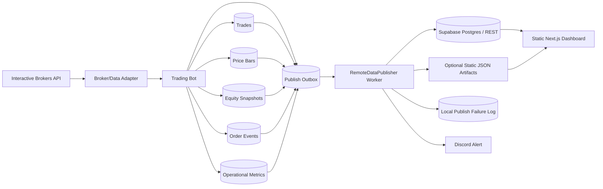
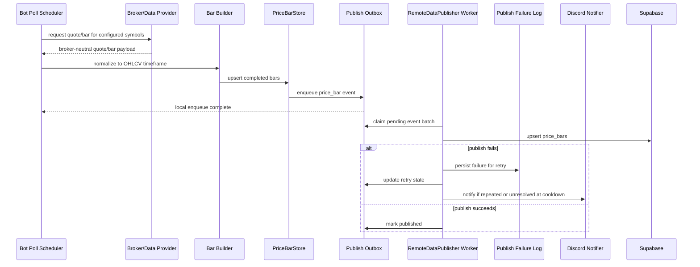
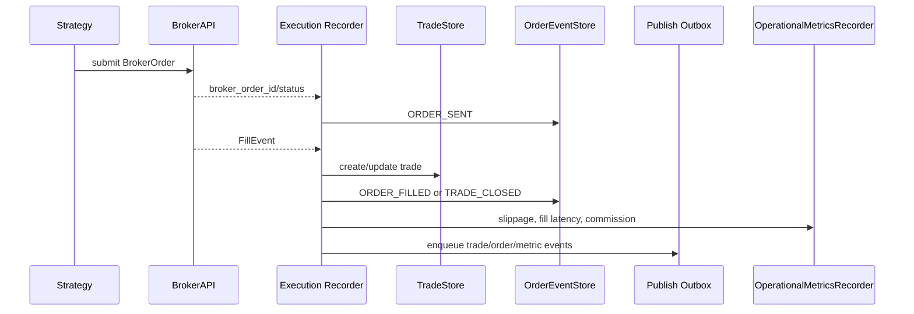

# Technical Design Spec: Live Trading Dashboard

**Version:** 1.0.0  
**Last Updated:** 2026-07-20  
**Status:** Published  
**Related PRD:** [PRD-live-dashboard.md](PRD-live-dashboard.md)

---

## 1. Overview

This document defines the technical design for the Live Trading Dashboard. The dashboard is a read-only monitoring and review surface for the trading bot. Phase 1 uses a static Next.js frontend hosted on GitHub Pages and dashboard-ready records written by the trading bot to durable storage.

The key design principle is separation of concerns:

- The trading bot owns broker/data-provider integration, persistence, and canonical metric calculations.
- The dashboard owns visualization, light filtering, and presentation.
- Provider-specific details, currently Interactive Brokers, stay behind broker/data adapters and do not leak into dashboard components.

---

## 2. Goals

| Goal | Description |
|------|-------------|
| Live monitoring | Show equity, open positions, order/trade events, health, and execution quality. |
| End-of-day review | Show the latest completed trading day and historical periods outside market hours. |
| Durable price storage | Persist OHLCV bars required by charts and future analysis. |
| Static hosting | Support GitHub Pages deployment with no paid services and no always-on dashboard server. |
| Provider neutrality | Keep dashboard contracts stable if IB is replaced by another broker, API, or WebSocket provider. |
| Future multi-account support | Phase 1 UI displays one account, but schemas include account identifiers. |

## 3. Non-Goals

| Non-Goal | Rationale |
|----------|-----------|
| Trading actions from dashboard | Dashboard is read-only; no place/cancel/modify order controls. |
| Phase 1 authentication | PRD accepts public unlisted URL for Phase 1. |
| Dashboard-owned financial calculations | Canonical P&L, expectancy, and rollups are calculated upstream. |
| Full realtime WebSocket stack | Phase 1 uses polling/read models. WebSocket support can be added behind the same data contract later. |
| Multi-account UI | Data model supports account IDs, but Phase 1 screens filter to one configured account. |

---

## 4. Existing Code Touchpoints

| Area | Existing Surface | Design Use |
|------|------------------|------------|
| Broker abstraction | `vibe/trading_bot/brokers/base.py` | Source of broker-neutral quotes, orders, fills, positions, and account summary. |
| IB adapter | `vibe/trading_bot/brokers/interactive_brokers.py` | Current paper/live broker and market-data provider. |
| Trade storage | `vibe/trading_bot/storage/trade_store.py` | Extend or migrate to include account IDs, broker order IDs, exit reasons, and dashboard query support. |
| Metrics storage | `vibe/trading_bot/storage/metrics_store.py` | Existing generic SQLite metric store. Useful for health and operational rollups. |
| Operational metrics | `vibe/trading_bot/storage/operational_metrics.py` | Existing fill-quality metric recorder and optional Supabase sink. |
| Config | `vibe/trading_bot/config/settings.py` | Add dashboard, price storage, and remote publication settings. |
| Static dashboard app | `apps/operational-metrics-dashboard/` | Existing Next.js pattern that can be reused or replaced by the live dashboard app. |

---

## 5. Target Architecture



Phase 1 should prefer Supabase REST for browser-readable data if row-level security and anonymous read policies are configured safely. Static JSON artifacts remain a fallback if Supabase pause behavior or browser access becomes problematic.

Remote publication uses an event-driven outbox pattern. The trading path writes local source-of-truth rows and a durable publish event, then returns immediately. A background `RemoteDataPublisher` worker drains the outbox and performs remote writes outside the latency-sensitive trading path.

---

## 6. Data Ownership

| Data | Owner | Writer | Reader |
|------|-------|--------|--------|
| Trades | Trading bot | Execution/order lifecycle path | Dashboard, reports, backtester audit |
| Order events | Trading bot | Broker adapter/order manager | Dashboard live feed |
| Positions | Trading bot | Broker account/position polling | Dashboard open positions panel |
| Equity snapshots | Trading bot | Account polling and mark-to-market loop | Dashboard equity curve |
| Price bars | Trading bot | Market-data ingestion/bar builder | Dashboard charts, future research |
| Operational metrics | Trading bot | Broker adapter, health monitor, metrics recorder | Dashboard operations view |
| Aggregated performance | Bot/backtester/backend job | Scheduled or event-driven calculation job | Dashboard performance panels |

---

## 7. Storage Design

### 7.1 Local SQLite

Local development uses SQLite files under `./data/`. The existing `TradeStore` and `MetricsStore` already use WAL mode. New stores should follow that pattern.

Recommended local files:

| Store | Path | Purpose |
|-------|------|---------|
| Trades | `./data/trades.db` | Trade entries/exits and order lifecycle linkage. |
| Price bars | `./data/market_data.db` | OHLCV bars for dashboard symbols/timeframes. |
| Operational metrics | `./data/local/operational_metrics.db` | Fill quality, API latency, health samples. |
| Publish outbox | `./data/local/publish_outbox.db` or colocated dashboard DB | Durable queue of remote publication events and retry state. |
| Dashboard read model | `./data/dashboard.db` or views | Optional precomputed local read model for export/publish jobs. |

Local SQLite is a short-lived durability buffer, not the long-term dashboard database. Because the Oracle VM has limited memory and disk headroom, Phase 1 should keep only 1-3 trading days of local dashboard files by default. Remote publication is the durable system of record for dashboard access.

Local retention rules:

- Keep recent SQLite rows/files long enough to survive transient remote outages during the trading day.
- During cooldown, reconcile unpublished or failed rows from local SQLite to the remote read model.
- After successful reconciliation, prune local dashboard rows/files older than the configured retention window.
- Never delete local rows that are still marked unpublished or failed; retry them first and alert if they remain stuck after cooldown.

### 7.2 Remote Read Model

Phase 1 remote storage is Supabase Postgres with browser-readable REST endpoints. Tables exposed to the dashboard must be read-only for the anonymous key.

Required security posture:

- Public dashboard key can only read selected dashboard tables/views.
- Bot write credentials are never shipped to the browser.
- Row-level security policies restrict writes to the bot service role and reads to dashboard-safe rows.
- Dashboard handles remote store unavailable/paused state gracefully.

### 7.3 Event-Driven Publish Outbox

Remote publication is event-driven through a durable local outbox. This keeps remote I/O out of the trading path while preserving recoverability after process restarts.

Trading-path rule:

```text
persist local source row
persist publish_outbox event
return to trading flow
```

The trading bot must not wait for Supabase, Neon, static artifact upload, Discord notification, or any remote telemetry call before continuing order submission, fill handling, market-data polling, or risk management.

Worker trigger model:

- SQLite does not push events to the worker by itself. The trigger is application-level.
- After a successful outbox insert, the enqueue path should signal an in-process `asyncio.Event` or equivalent lightweight wake mechanism.
- The `RemoteDataPublisher` worker wakes on that signal and claims eligible outbox rows.
- The worker also polls on a low-frequency interval, for example every 5-10 minutes, so missed wake signals or process restarts still drain pending rows.
- Cooldown explicitly calls `flush_pending()` / `reconcile()` instead of waiting for the normal polling interval.
- If the wake signal fails, the durable outbox plus periodic polling still preserves correctness; only publication latency is affected.

Recommended `publish_outbox` schema:

| Column | Type | Notes |
|--------|------|-------|
| event_id | text primary key | Stable event ID for idempotency. |
| event_type | text | `upsert`, `delete`, `snapshot`, etc. |
| aggregate_type | text | `trade`, `order_event`, `price_bar`, `equity_snapshot`, `position`, `metric`. |
| aggregate_id | text | Stable source record ID or composite key. |
| destination | text | `supabase`, `static_json`, future target. |
| payload_json | text/json | Serialized provider-neutral payload. |
| status | text | `pending`, `publishing`, `published`, `failed`, `dead_letter`. |
| attempts | integer | Number of publish attempts. |
| next_retry_at | text/timestamptz | Backoff scheduling timestamp. |
| last_error | text nullable | Most recent failure. |
| original_event_timestamp | text/timestamptz | Original business/event timestamp copied from the source row for ordering and recovery. |
| created_at | text/timestamptz | Insert time. |
| updated_at | text/timestamptz | Last state change. |

Outbox requirements:

- Insert outbox events in the same local transaction as the source row when practical.
- Use idempotent remote keys so retrying a published event is harmless.
- Claim pending rows in small batches to limit memory and CPU impact.
- Keep retry state durable so restarts resume where the bot left off.
- Preserve original business timestamps in both the source row and outbox payload; retries and cooldown reconciliation must never replace them with publish/retry time.
- Mark rows `dead_letter` only after configured retry/cooldown thresholds are exceeded.

Timestamp preservation rules:

- `created_at`, `updated_at`, `ingestion_time`, `claimed_at`, and retry timestamps describe storage or publisher mechanics.
- Domain timestamps describe what actually happened and must remain immutable once captured: `entry_time`, `exit_time`, `occurred_at`, `bar_start`, equity snapshot `timestamp`, position `updated_at` when sourced from broker state, and metric sample `timestamp`.
- Remote payloads must carry the domain timestamp from the source row, not the time the publisher retries or succeeds.
- Cooldown reconciliation must reconstruct missing outbox events from local source rows using the original domain timestamps.
- If a row is retried multiple times, ordering in the dashboard should be based on the domain timestamp, with publish metadata available only for diagnostics.

Concurrency and race-safety rules:

- The trading path only inserts `pending` outbox rows. It does not update retry state, claim rows, or perform remote writes.
- The publisher worker claims and updates existing outbox rows. It owns `status`, `attempts`, `last_error`, `next_retry_at`, `claimed_at`, and publish completion fields.
- Cooldown reconciliation uses the same ownership rules as the publisher worker, but runs a focused flush/prune pass before local retention cleanup.
- Use SQLite WAL mode and a short `busy_timeout`, matching the existing store pattern.
- Keep outbox transactions short. Never hold a SQLite transaction while performing remote HTTP calls.
- Claim rows with an atomic transaction that moves eligible rows from `pending` to `publishing`, then commit before remote publication.
- Use one publisher worker for Phase 1. Add multiple workers only if measured publish volume requires it and claim semantics have been tested under contention.
- Treat stale `publishing` rows with old `claimed_at` values as recoverable after process restart.
- If outbox insertion fails because SQLite is briefly locked, this is telemetry degradation rather than a trading failure. Persist the source-of-truth row first, log the enqueue failure, and let cooldown reconciliation scan local source tables for unpublished rows.

Recommended claim flow:

```sql
BEGIN IMMEDIATE;

SELECT event_id
FROM publish_outbox
WHERE status = 'pending'
    AND next_retry_at <= ?
ORDER BY created_at
LIMIT ?;

UPDATE publish_outbox
SET status = 'publishing',
        claimed_by = ?,
        claimed_at = ?,
        updated_at = ?
WHERE event_id IN (...selected ids...)
    AND status = 'pending';

COMMIT;
```

Remote publication happens after the claim transaction commits. The worker then marks each claimed row `published`, returns it to `pending` with retry metadata, or moves it to `dead_letter` after thresholds are exceeded.

### 7.4 RemoteDataPublisher Utility

Remote publishing must be encapsulated in a central utility class, tentatively named `RemoteDataPublisher`. It owns all provider-specific remote write logic for Supabase, Neon-backed APIs, static JSON artifact uploads, or future destinations. Trading code should enqueue events through a small provider-neutral outbox interface and should not know whether the destination is Supabase, Neon, or another service.

Phase 1 worker placement:

- Run `RemoteDataPublisher` inside the trading bot process as a background asyncio task.
- Keep the worker logically isolated from the trading path through the durable outbox.
- Use bounded batch size, low concurrency, per-request timeouts, retry backoff, and a circuit breaker when the remote destination is unavailable.
- Wake the worker after local outbox enqueue, with periodic polling as a fallback.
- Do not deploy a separate worker process until data volume, remote publishing latency, or operational evidence justifies the extra complexity.

Required behaviour:

- Remote publishing is best-effort and non-blocking for trading decisions.
- Publishing failures must never stop order submission, fill processing, market-data polling, or risk management.
- Failures are written to a local publish failure log with payload type, destination, retry count, error message, and timestamp.
- Failures generate operational telemetry so the dashboard can show degraded publishing status.
- Repeated or cooldown-unresolved failures generate a Discord notification through the standard notification path.
- The utility supports idempotent upserts so retrying after a transient failure cannot duplicate trades, bars, snapshots, or events.
- The cooldown phase invokes reconciliation to flush pending local rows before pruning local storage.

---

## 8. Core Tables

### 8.1 accounts

| Column | Type | Notes |
|--------|------|-------|
| account_id | text primary key | Broker account ID or normalized internal ID. |
| broker | text | `interactive_brokers`, future broker name, etc. |
| display_name | text | Human-friendly label. |
| currency | text | Default `USD`. |
| mode | text | `paper` or `live`. |
| created_at | timestamptz | Insert time. |
| updated_at | timestamptz | Last update. |

Phase 1 stores one account but all account-scoped records reference `account_id`.

### 8.2 trades

| Column | Type | Notes |
|--------|------|-------|
| trade_id | text primary key | Stable internal ID. |
| account_id | text | References `accounts.account_id`. |
| symbol | text | Ticker. |
| side | text | `long` or `short`. |
| quantity | numeric | Share quantity. |
| entry_price | numeric | Average entry fill. |
| entry_time | timestamptz | Entry fill time. |
| exit_price | numeric nullable | Average exit fill. |
| exit_time | timestamptz nullable | Exit fill time. |
| status | text | `open`, `closed`, `cancelled`, `error`. |
| pnl | numeric nullable | Realized P&L. |
| pnl_pct | numeric nullable | Realized percent return. |
| strategy | text | Strategy name, e.g. `orb`. |
| exit_reason | text nullable | `stop`, `take_profit`, `trailing_stop`, `eod`, `manual`, etc. |
| created_at | timestamptz | Insert time. |
| updated_at | timestamptz | Last update. |

`entry_time` and `exit_time` are event times and must not be rewritten during remote publish retries or cooldown reconciliation.

### 8.3 order_events

| Column | Type | Notes |
|--------|------|-------|
| event_id | text primary key | Stable event ID. |
| account_id | text | Account key. |
| broker | text | Provider name. |
| broker_order_id | text | Broker order ID. |
| strategy_order_id | text nullable | Internal strategy order ID. |
| trade_id | text nullable | Linked trade if known. |
| event_type | text | `ORDER_SENT`, `ORDER_FILLED`, `ORDER_CANCELLED`, `TRADE_CLOSED`. |
| symbol | text | Ticker. |
| side | text | Buy/sell or long/short context. |
| quantity | numeric | Event quantity. |
| price | numeric nullable | Event price. |
| expected_price | numeric nullable | Expected fill/reference price. |
| slippage_bps | numeric nullable | Execution quality metric. |
| latency_ms | numeric nullable | Submission-to-fill or request latency. |
| occurred_at | timestamptz | Event time. |
| raw_status | text nullable | Broker status. |

`occurred_at` is the broker/order lifecycle event time. Publisher retries must preserve it exactly.

### 8.4 price_bars

| Column | Type | Notes |
|--------|------|-------|
| symbol | text | Ticker. |
| timeframe | text | `1m`, `5m`, `1d`, etc. |
| bar_start | timestamptz | Start timestamp in market timezone converted/stored consistently. |
| open | numeric | Open price. |
| high | numeric | High price. |
| low | numeric | Low price. |
| close | numeric | Close price. |
| volume | numeric | Volume. |
| provider | text | Source provider, currently `interactive_brokers`; retained for provider accuracy analysis and future provider comparisons. |
| ingestion_time | timestamptz | When bot persisted the bar. |
| is_complete | boolean | True for closed bars used by charts/backtests. |

Primary key: `(symbol, timeframe, bar_start)`.

`bar_start` is the market-data event time used for chart ordering and OHLCV joins. `ingestion_time` records when the bot stored the bar and should not replace `bar_start` in dashboard charts.

### 8.5 equity_snapshots

| Column | Type | Notes |
|--------|------|-------|
| snapshot_id | text primary key | Stable ID. |
| account_id | text | Account key. |
| timestamp | timestamptz | Snapshot time. |
| net_liquidation | numeric nullable | Broker account value. |
| cash | numeric nullable | Cash. |
| buying_power | numeric nullable | Buying power. |
| realized_pnl | numeric nullable | Day/session realized P&L. |
| unrealized_pnl | numeric nullable | Mark-to-market P&L. |
| source | text | Broker, derived, or backfilled. |

`timestamp` is the account/equity observation time. Cooldown reconciliation must preserve this timestamp so the equity curve does not shift to cooldown or retry time.

### 8.6 positions

| Column | Type | Notes |
|--------|------|-------|
| position_id | text primary key | Stable account-symbol key or snapshot key. |
| account_id | text | Account key. |
| symbol | text | Ticker. |
| quantity | numeric | Signed or side-normalized quantity. |
| side | text | `long`, `short`, or `flat`. |
| avg_cost | numeric nullable | Average cost. |
| market_price | numeric nullable | Last known mark. |
| unrealized_pnl | numeric nullable | Open P&L. |
| updated_at | timestamptz | Last update. |

For dashboard display, `updated_at` represents the broker/mark observation time for the position. Retries and remote publishes must not overwrite it with publish time.

### 8.7 strategy_annotations

| Column | Type | Notes |
|--------|------|-------|
| annotation_id | text primary key | Stable ID. |
| account_id | text | Account key. |
| symbol | text | Ticker. |
| strategy | text | Strategy name. |
| trading_day | date | Market date. |
| annotation_type | text | `level`, `zone`, `marker`, `label`. |
| key | text | `orb_high`, `orb_low`, `stop_loss`, `take_profit`, etc. |
| value_json | jsonb | Flexible payload for chart rendering. |
| enabled | boolean | Whether dashboard should render it. |
| created_at | timestamptz | Insert time. |
| updated_at | timestamptz | Last update. |

### 8.8 operational_metrics

Existing operational metrics can continue using the generic metric model:

| Column | Type | Notes |
|--------|------|-------|
| metric_name | text | `slippage_bps`, `latency_ms`, `api_latency_ms`, etc. |
| metric_value | numeric | Numeric value. |
| dimensions | jsonb | Include account, broker, symbol, operation, status. |
| timestamp | timestamptz | Sample time. |
| created_at | timestamptz | Insert time. |

`timestamp` is the metric sample time. Publisher retry time should only appear in publish metadata or failure logs.

### 8.9 Table Rationale

**Why keep `accounts` separate from `equity_snapshots`:** `accounts` is slow-changing account metadata: broker, account ID, display name, currency, and paper/live mode. `equity_snapshots` is time-series data that can produce many rows per day. Combining them would duplicate account metadata on every snapshot and make future multi-account filtering messier. Keeping them separate also lets Phase 1 display one account while preserving a clean path to multiple accounts later.

**Why keep `trades` separate from `positions`:** `trades` are completed or in-progress strategy lifecycle records used for P&L, expectancy, win rate, and journal views. `positions` are the current broker/account state used for the open positions panel and mark-to-market monitoring. A position can be affected by multiple fills, partial exits, manual broker-side changes, or future strategies. Keeping both tables lets the dashboard answer two different questions: "What trades did the strategy take?" and "What does the broker account currently hold?"

**Why keep provider on `price_bars`:** provider is part of the data lineage. It enables later analysis of provider accuracy, provider outages, and differences between IB data and a future market-data source. The dashboard should not branch on provider for normal rendering, but the field should be available for diagnostics and research.

---

## 9. Ingestion Flows

### 9.1 Price Bar Persistence



Rules:

- Persist completed bars only for canonical chart data.
- Store incomplete/current bars separately or mark `is_complete = false` if needed for the live price line.
- Use provider-neutral symbols and market timestamps.
- Upsert bars by `(symbol, timeframe, bar_start)` to avoid duplicates after restarts.
- Trading code only persists the local bar and outbox event; remote writes happen asynchronously in the publisher worker.

### 9.2 Trade And Order Persistence



Rules:

- Record every broker lifecycle event, even if no trade is opened.
- Link orders to trades when the strategy/order manager knows the relationship.
- Preserve expected price and actual fill price for execution-quality analysis.
- Include `account_id` on every persisted row.
- Local persistence and outbox enqueue are the only mandatory trading-path operations; remote publication is asynchronous.

### 9.3 Equity And Position Snapshots

- Poll account summary and positions after order events.
- Poll at the configured cadence: 1 minute while active, 5 minutes while flat.
- Persist snapshots whenever values change or at least once per polling interval.
- Keep latest-position rows for fast dashboard reads and historical snapshots for equity curves.

### 9.4 Dashboard Publication

Two publication paths are supported:

| Path | Use When | Mechanism |
|------|----------|-----------|
| Supabase REST | Default Phase 1 | Bot writes/upserts dashboard tables with service credentials; dashboard reads with anon read-only key. |
| Static JSON artifacts | Supabase pause or browser DB access is unacceptable | Bot/job exports compact JSON files to a static location consumed by GitHub Pages. |

All paths are implemented behind `RemoteDataPublisher`. The publisher worker drains `publish_outbox` rows and dispatches internally to methods such as `publish_trade`, `publish_order_event`, `publish_price_bar`, `publish_equity_snapshot`, `publish_position`, and `publish_metric`, while sharing batching, retry, idempotency, failure logging, and Discord escalation logic internally.

### 9.5 Cooldown Phase Updates

The cooldown phase becomes the daily reconciliation and cleanup boundary for dashboard telemetry. It should remain bounded and non-critical: if reconciliation fails, the bot should report degraded telemetry and keep local rows for the next retry rather than treating the trading day as failed.

Cooldown responsibilities:

1. Stop creating new trading entries before reconciliation begins, while allowing final fills and position-close events to persist.
2. Force a final account, position, equity, and health snapshot.
3. Flush pending `publish_outbox` rows with a bounded time budget and small batches.
4. Re-scan local source tables for dashboard-relevant rows that have no outbox record or remain unpublished.
5. Enqueue missing publish events discovered during the scan using the original source-row timestamps.
6. Retry failed rows whose `next_retry_at` is due.
7. Mark rows `dead_letter` only after configured retry limits or cooldown thresholds are exceeded.
8. Emit operational telemetry summarizing published, pending, failed, and dead-letter counts.
9. Send a Discord notification if any rows remain failed, unpublished, or dead-lettered after cooldown reconciliation.
10. Prune local dashboard SQLite rows/files older than the 1-3 day retention window only after they are confirmed published or intentionally dead-lettered.

Suggested cooldown API:

```text
RemoteDataPublisher.flush_pending(timeout_seconds, max_batches)
RemoteDataPublisher.reconcile_sources(source_stores, trading_day)
RemoteDataPublisher.prune_published_before(cutoff_timestamp)
RemoteDataPublisher.publish_cooldown_summary()
```

Cooldown success criteria:

- All due outbox rows are either `published`, scheduled for retry, or explicitly `dead_letter` with an error reason.
- Original domain timestamps are preserved for every reconciled or retried row, especially equity snapshots, positions, price bars, trades, order events, and metrics.
- Local retention cleanup never deletes unpublished source rows.
- Discord receives a summary when telemetry is degraded.
- The cooldown phase logs enough detail to recover manually if remote publication is unavailable.

---

## 10. Dashboard Frontend Design

### 10.1 App Structure

Recommended location:

```text
apps/operational-metrics-dashboard/
```

Reuse the existing Next.js app under `apps/operational-metrics-dashboard` and evolve it into the live trading dashboard rather than creating a second dashboard app. Rename later only if the old name becomes actively confusing; avoiding a second app keeps deployment, package management, and design work simpler.

Recommended technology:

| Layer | Choice |
|-------|--------|
| Framework | Next.js with static export |
| Hosting | GitHub Pages |
| Charting | TradingView Lightweight Charts |
| Styling | Tailwind or local CSS with design tokens; implement light and dark mode from the first dashboard iteration |
| Data access | Supabase REST client or static JSON adapter |

Light/dark mode requirements:

- Define semantic color tokens for background, foreground, panels, borders, muted text, profit, loss, warning, and health states.
- Default to system preference with a visible user toggle.
- Persist the user preference in local storage.
- Validate charts, tables, and health colors in both themes so red/green trading states remain legible.
- Avoid hard-coded chart colors inside components; route TradingView chart colors through the same theme tokens.

### 10.2 Data Adapter Boundary

Dashboard components should read from a small frontend data adapter rather than calling Supabase directly everywhere.

```text
src/data/
  dashboardClient.ts
  supabaseDashboardClient.ts
  staticJsonDashboardClient.ts
  types.ts
```

This keeps the UI stable if the data source changes from Supabase to Neon-backed API, static JSON, or another backend.

### 10.3 Primary Views

| View | Phase | Data |
|------|-------|------|
| Live View | P0 | Equity snapshots, positions, order events, price bars, annotations. |
| Charts | P0 | Price bars, current price, strategy annotations, trade markers. |
| Operations | P0/P1 | Health metrics, API latency, data freshness, execution quality. |
| Performance | P0/P1 | Precomputed performance metrics and trade summaries. |
| History | P1/P2 | Trades, calendar summaries, export data. |

---

## 11. Provider Neutrality

Provider-specific adapters must normalize inputs into dashboard contracts before persistence.

| Provider Detail | Normalized Field |
|-----------------|------------------|
| IB account code | `account_id` |
| IB order ID | `broker_order_id` |
| IB quote/ticker payload | `BrokerQuote` and `price_bars` rows |
| IB fill status | `order_events.raw_status` plus normalized `event_type` |
| Future WebSocket ticks | Same `price_bars`/latest price read model |

The dashboard should never branch on `interactive_brokers` except for optional display labels.

---

## 12. Configuration

Add or extend settings in `vibe/trading_bot/config/settings.py`.

| Setting | Example | Purpose |
|---------|---------|---------|
| `dashboard.enabled` | `true` | Enable dashboard persistence/publication. |
| `dashboard.account_id` | `DU1234567` | Phase 1 selected account. |
| `dashboard.symbols` | `["AAPL", "GOOGL", "MSFT"]` | Symbols to persist/render. |
| `dashboard.price_timeframes` | `["5m", "1d"]` | Required chart timeframes. |
| `dashboard.local_price_db_path` | `./data/market_data.db` | Local price store path. |
| `dashboard.remote_provider` | `supabase` | Remote read model provider. |
| `dashboard.supabase_url` | env var | Supabase project URL. |
| `dashboard.supabase_service_key` | env var | Bot-only write key, never exposed to browser. |
| `dashboard.supabase_anon_key` | env var | Browser read-only key. |
| `dashboard.publish_interval_seconds` | `30` | Batch publish interval. |

---

## 13. Testing Strategy

| Test Type | Scope |
|-----------|-------|
| Unit tests | Price bar upsert/idempotency, trade/order event mapping, account ID propagation, metric calculations. |
| Contract tests | Dashboard data adapter fixtures match Supabase/static JSON payloads. |
| Integration tests | IB smoke flow writes order events, fills, trades, metrics, account snapshots, and price bars. |
| Dashboard tests | Static build succeeds, charts render non-empty with fixture data, empty/unavailable states render clearly. |
| Migration tests | Existing SQLite trade DB migrates or backfills required fields without data loss. |

Minimum Phase 1 validation:

1. Run bot in paper mode with IB connected.
2. Persist at least one completed 5-minute OHLCV bar for each dashboard symbol.
3. Submit a paper order and confirm order event, trade, fill metrics, and equity snapshot rows.
4. Publish read model to Supabase or static JSON.
5. Build static Next.js dashboard and verify charts/trade feed with real rows.

---

## 14. Implementation Plan

The working stage-by-stage execution tracker lives in [Live Dashboard Execution Checklist](live-dashboard-execution-checklist.md). Keep implementation status, checkboxes, and day-to-day progress updates in that document so this published TDS only changes when the approved technical design changes.

### Stage 1: Persistence Foundation

- Add local SQLite stores, migrations, dashboard settings, and outbox persistence.
- Prove clean DB creation, idempotent writes, and existing trade backfill safety with focused tests.

### Stage 2: Bot Integration

- Wire stores into market data, order lifecycle, account snapshot, and metric paths.
- Ensure every dashboard-relevant source row produces or can reconstruct a publish event without blocking trading flow.

### Stage 3: Remote Read Model

- Define Supabase read-model tables/views, RLS policies, and idempotent upsert contracts.
- Implement `RemoteDataPublisher`, retry/recovery behavior, cooldown reconciliation, failure telemetry, and Discord escalation.

### Stage 4: Static Dashboard

- Evolve `apps/operational-metrics-dashboard` into the live dashboard with a data adapter boundary.
- Build Live, Charts, Operations, and Performance views with fixture-first validation and static export support.

### Stage 5: End-to-End Validation

- Run IB paper smoke validation, publish real rows, build/deploy the static dashboard, and document operator setup and recovery.
- Confirm the Phase 1 acceptance criteria with real paper-trading data and browser-safe credentials only.

---

## 15. Open Technical Decisions

| Decision | Options | Current Lean |
|----------|---------|--------------|
| Remote read model | Supabase REST vs static JSON artifacts | Supabase REST, verify pause/data preservation. |
| Price store file | Separate `market_data.db` vs combined `trades.db` | Separate `market_data.db` to avoid chart reads competing with trade writes. |
| Current/incomplete bar handling | Store with `is_complete=false` vs latest quote table | Start with completed bars plus latest quote/position data; add incomplete bars only if needed. |
| Dashboard app reuse | Reuse `operational-metrics-dashboard` vs create new app | Reuse `apps/operational-metrics-dashboard` and evolve it into the live dashboard. |
| Metric rollup job | In bot process vs separate backend/job | Start in bot process with lightweight scheduled calculation; move out if it threatens bot resources. |
| Publisher worker placement | In-process background task vs separate process/app | Start in-process with durable outbox; split out only if measured publishing load requires it. |
| Publisher worker trigger | SQLite trigger vs app-level signal plus polling | Use app-level wake signal after enqueue, with periodic polling fallback; avoid SQLite triggers for remote publishing. |

---

## 16. Risks And Mitigations

| Risk | Mitigation |
|------|------------|
| Dashboard queries affect bot performance | Static dashboard reads remote read model, never bot process. |
| Supabase pauses | Dashboard shows unavailable state; verify data preservation; keep static JSON fallback. |
| Browser exposes write credentials | Use anon read-only key only; bot service key stays server-side. |
| Remote publish failure disrupts trading | `RemoteDataPublisher` is best-effort and non-blocking; failures are logged locally, retried during cooldown, and escalated via Discord. |
| In-memory queue loses events on restart | Use durable SQLite `publish_outbox`; do not rely on an in-memory-only event bus. |
| SQLite contention between trading path and publisher | Trading path only inserts; publisher claims/updates in short WAL-mode transactions, publishes outside transactions, and uses one worker in Phase 1. |
| Publisher wake signal is missed | Periodic polling and explicit cooldown flush still drain durable outbox rows. |
| Retry/cooldown shifts chart or equity timing | Treat domain timestamps as immutable and separate them from publisher metadata such as `created_at`, `updated_at`, `claimed_at`, and `ingestion_time`. |
| Provider change breaks dashboard | Persist provider-neutral read model and keep provider labels as metadata. |
| Price storage grows too quickly | Start with dashboard symbols/timeframes only; keep local SQLite to 1-3 days, reconcile during cooldown, prune successfully published rows, and retain long-term history remotely. |
| Existing trade schema lacks account IDs | Add migration/backfill with configured Phase 1 account ID. |

---

## 17. Acceptance Criteria

Phase 1 technical design is implemented when:

- PRD is published and this TDS is approved for implementation.
- Bot persists trades, order events, price bars, positions, equity snapshots, and operational metrics with account IDs.
- Bot writes durable `publish_outbox` events for each dashboard-relevant local row without waiting on remote publication.
- `RemoteDataPublisher` runs as an in-process background worker and can retry after process restart.
- Outbox enqueue wakes the publisher worker, periodic polling drains missed work, and cooldown explicitly flushes/reconciles pending telemetry.
- Retried and cooldown-reconciled records preserve their original domain timestamps instead of using publish or retry time.
- Static Next.js dashboard builds for GitHub Pages.
- Dashboard renders fixture data and real published paper-trading data.
- Dashboard remains read-only and uses no browser-exposed write credentials.
