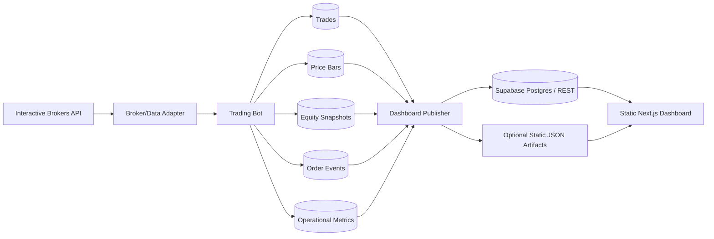
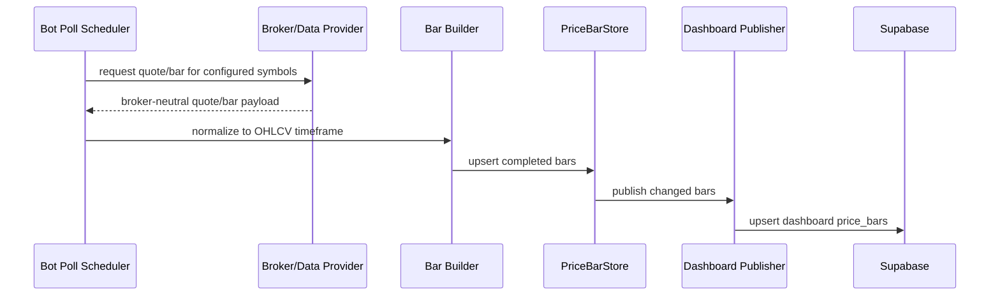
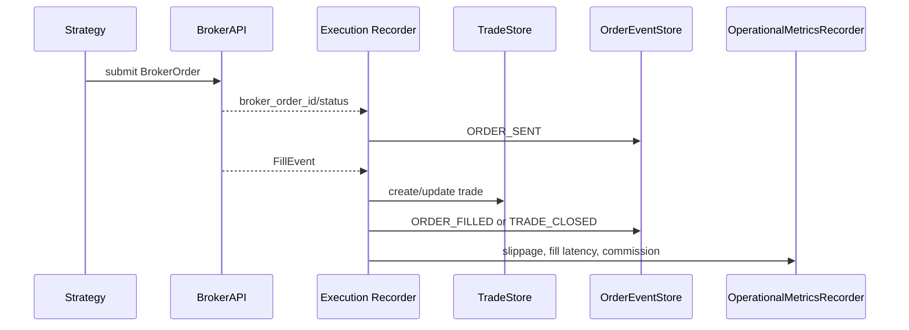

# Technical Design Spec: Live Trading Dashboard

**Version:** 0.1.0  
**Last Updated:** 2026-07-17  
**Status:** Draft  
**Related PRD:** [PRD-live-dashboard.md](PRD-live-dashboard.md)

---

## 1. Overview

This document defines the technical design for the Live Trading Dashboard. The dashboard is a read-only monitoring and review surface for the trading bot. Phase 1 uses a static Next.js frontend hosted on GitHub Pages and dashboard-ready records written by the trading bot to durable storage.

The key design principle is separation of concerns:

- The trading bot owns broker/data-provider integration, persistence, and canonical metric calculations.
- The dashboard owns visualization, light filtering, and presentation.
- Provider-specific details, currently Interactive Brokers, stay behind broker/data adapters and do not leak into dashboard components.

---

## 2. Goals

| Goal | Description |
|------|-------------|
| Live monitoring | Show equity, open positions, order/trade events, health, and execution quality. |
| End-of-day review | Show the latest completed trading day and historical periods outside market hours. |
| Durable price storage | Persist OHLCV bars required by charts and future analysis. |
| Static hosting | Support GitHub Pages deployment with no paid services and no always-on dashboard server. |
| Provider neutrality | Keep dashboard contracts stable if IB is replaced by another broker, API, or WebSocket provider. |
| Future multi-account support | Phase 1 UI displays one account, but schemas include account identifiers. |

## 3. Non-Goals

| Non-Goal | Rationale |
|----------|-----------|
| Trading actions from dashboard | Dashboard is read-only; no place/cancel/modify order controls. |
| Phase 1 authentication | PRD accepts public unlisted URL for Phase 1. |
| Dashboard-owned financial calculations | Canonical P&L, expectancy, and rollups are calculated upstream. |
| Full realtime WebSocket stack | Phase 1 uses polling/read models. WebSocket support can be added behind the same data contract later. |
| Multi-account UI | Data model supports account IDs, but Phase 1 screens filter to one configured account. |

---

## 4. Existing Code Touchpoints

| Area | Existing Surface | Design Use |
|------|------------------|------------|
| Broker abstraction | `vibe/trading_bot/brokers/base.py` | Source of broker-neutral quotes, orders, fills, positions, and account summary. |
| IB adapter | `vibe/trading_bot/brokers/interactive_brokers.py` | Current paper/live broker and market-data provider. |
| Trade storage | `vibe/trading_bot/storage/trade_store.py` | Extend or migrate to include account IDs, broker order IDs, exit reasons, and dashboard query support. |
| Metrics storage | `vibe/trading_bot/storage/metrics_store.py` | Existing generic SQLite metric store. Useful for health and operational rollups. |
| Operational metrics | `vibe/trading_bot/storage/operational_metrics.py` | Existing fill-quality metric recorder and optional Supabase sink. |
| Config | `vibe/trading_bot/config/settings.py` | Add dashboard, price storage, and remote publication settings. |
| Static dashboard app | `apps/operational-metrics-dashboard/` | Existing Next.js pattern that can be reused or replaced by the live dashboard app. |

---

## 5. Target Architecture



Phase 1 should prefer Supabase REST for browser-readable data if row-level security and anonymous read policies are configured safely. Static JSON artifacts remain a fallback if Supabase pause behavior or browser access becomes problematic.

---

## 6. Data Ownership

| Data | Owner | Writer | Reader |
|------|-------|--------|--------|
| Trades | Trading bot | Execution/order lifecycle path | Dashboard, reports, backtester audit |
| Order events | Trading bot | Broker adapter/order manager | Dashboard live feed |
| Positions | Trading bot | Broker account/position polling | Dashboard open positions panel |
| Equity snapshots | Trading bot | Account polling and mark-to-market loop | Dashboard equity curve |
| Price bars | Trading bot | Market-data ingestion/bar builder | Dashboard charts, future research |
| Operational metrics | Trading bot | Broker adapter, health monitor, metrics recorder | Dashboard operations view |
| Aggregated performance | Bot/backtester/backend job | Scheduled or event-driven calculation job | Dashboard performance panels |

---

## 7. Storage Design

### 7.1 Local SQLite

Local development uses SQLite files under `./data/`. The existing `TradeStore` and `MetricsStore` already use WAL mode. New stores should follow that pattern.

Recommended local files:

| Store | Path | Purpose |
|-------|------|---------|
| Trades | `./data/trades.db` | Trade entries/exits and order lifecycle linkage. |
| Price bars | `./data/market_data.db` | OHLCV bars for dashboard symbols/timeframes. |
| Operational metrics | `./data/local/operational_metrics.db` | Fill quality, API latency, health samples. |
| Dashboard read model | `./data/dashboard.db` or views | Optional precomputed local read model for export/publish jobs. |

### 7.2 Remote Read Model

Phase 1 remote storage is Supabase Postgres with browser-readable REST endpoints. Tables exposed to the dashboard must be read-only for the anonymous key.

Required security posture:

- Public dashboard key can only read selected dashboard tables/views.
- Bot write credentials are never shipped to the browser.
- Row-level security policies restrict writes to the bot service role and reads to dashboard-safe rows.
- Dashboard handles remote store unavailable/paused state gracefully.

---

## 8. Core Tables

### 8.1 accounts

| Column | Type | Notes |
|--------|------|-------|
| account_id | text primary key | Broker account ID or normalized internal ID. |
| broker | text | `interactive_brokers`, future broker name, etc. |
| display_name | text | Human-friendly label. |
| currency | text | Default `USD`. |
| mode | text | `paper` or `live`. |
| created_at | timestamptz | Insert time. |
| updated_at | timestamptz | Last update. |

Phase 1 stores one account but all account-scoped records reference `account_id`.

### 8.2 trades

| Column | Type | Notes |
|--------|------|-------|
| trade_id | text primary key | Stable internal ID. |
| account_id | text | References `accounts.account_id`. |
| symbol | text | Ticker. |
| side | text | `long` or `short`. |
| quantity | numeric | Share quantity. |
| entry_price | numeric | Average entry fill. |
| entry_time | timestamptz | Entry fill time. |
| exit_price | numeric nullable | Average exit fill. |
| exit_time | timestamptz nullable | Exit fill time. |
| status | text | `open`, `closed`, `cancelled`, `error`. |
| pnl | numeric nullable | Realized P&L. |
| pnl_pct | numeric nullable | Realized percent return. |
| strategy | text | Strategy name, e.g. `orb`. |
| exit_reason | text nullable | `stop`, `take_profit`, `trailing_stop`, `eod`, `manual`, etc. |
| created_at | timestamptz | Insert time. |
| updated_at | timestamptz | Last update. |

### 8.3 order_events

| Column | Type | Notes |
|--------|------|-------|
| event_id | text primary key | Stable event ID. |
| account_id | text | Account key. |
| broker | text | Provider name. |
| broker_order_id | text | Broker order ID. |
| strategy_order_id | text nullable | Internal strategy order ID. |
| trade_id | text nullable | Linked trade if known. |
| event_type | text | `ORDER_SENT`, `ORDER_FILLED`, `ORDER_CANCELLED`, `TRADE_CLOSED`. |
| symbol | text | Ticker. |
| side | text | Buy/sell or long/short context. |
| quantity | numeric | Event quantity. |
| price | numeric nullable | Event price. |
| expected_price | numeric nullable | Expected fill/reference price. |
| slippage_bps | numeric nullable | Execution quality metric. |
| latency_ms | numeric nullable | Submission-to-fill or request latency. |
| occurred_at | timestamptz | Event time. |
| raw_status | text nullable | Broker status. |

### 8.4 price_bars

| Column | Type | Notes |
|--------|------|-------|
| symbol | text | Ticker. |
| timeframe | text | `1m`, `5m`, `1d`, etc. |
| bar_start | timestamptz | Start timestamp in market timezone converted/stored consistently. |
| open | numeric | Open price. |
| high | numeric | High price. |
| low | numeric | Low price. |
| close | numeric | Close price. |
| volume | numeric | Volume. |
| provider | text | Source provider, currently `interactive_brokers`. |
| ingestion_time | timestamptz | When bot persisted the bar. |
| is_complete | boolean | True for closed bars used by charts/backtests. |

Primary key: `(symbol, timeframe, bar_start)`.

### 8.5 equity_snapshots

| Column | Type | Notes |
|--------|------|-------|
| snapshot_id | text primary key | Stable ID. |
| account_id | text | Account key. |
| timestamp | timestamptz | Snapshot time. |
| net_liquidation | numeric nullable | Broker account value. |
| cash | numeric nullable | Cash. |
| buying_power | numeric nullable | Buying power. |
| realized_pnl | numeric nullable | Day/session realized P&L. |
| unrealized_pnl | numeric nullable | Mark-to-market P&L. |
| source | text | Broker, derived, or backfilled. |

### 8.6 positions

| Column | Type | Notes |
|--------|------|-------|
| position_id | text primary key | Stable account-symbol key or snapshot key. |
| account_id | text | Account key. |
| symbol | text | Ticker. |
| quantity | numeric | Signed or side-normalized quantity. |
| side | text | `long`, `short`, or `flat`. |
| avg_cost | numeric nullable | Average cost. |
| market_price | numeric nullable | Last known mark. |
| unrealized_pnl | numeric nullable | Open P&L. |
| updated_at | timestamptz | Last update. |

### 8.7 strategy_annotations

| Column | Type | Notes |
|--------|------|-------|
| annotation_id | text primary key | Stable ID. |
| account_id | text | Account key. |
| symbol | text | Ticker. |
| strategy | text | Strategy name. |
| trading_day | date | Market date. |
| annotation_type | text | `level`, `zone`, `marker`, `label`. |
| key | text | `orb_high`, `orb_low`, `stop_loss`, `take_profit`, etc. |
| value_json | jsonb | Flexible payload for chart rendering. |
| enabled | boolean | Whether dashboard should render it. |
| created_at | timestamptz | Insert time. |
| updated_at | timestamptz | Last update. |

### 8.8 operational_metrics

Existing operational metrics can continue using the generic metric model:

| Column | Type | Notes |
|--------|------|-------|
| metric_name | text | `slippage_bps`, `latency_ms`, `api_latency_ms`, etc. |
| metric_value | numeric | Numeric value. |
| dimensions | jsonb | Include account, broker, symbol, operation, status. |
| timestamp | timestamptz | Sample time. |
| created_at | timestamptz | Insert time. |

---

## 9. Ingestion Flows

### 9.1 Price Bar Persistence



Rules:

- Persist completed bars only for canonical chart data.
- Store incomplete/current bars separately or mark `is_complete = false` if needed for the live price line.
- Use provider-neutral symbols and market timestamps.
- Upsert bars by `(symbol, timeframe, bar_start)` to avoid duplicates after restarts.

### 9.2 Trade And Order Persistence



Rules:

- Record every broker lifecycle event, even if no trade is opened.
- Link orders to trades when the strategy/order manager knows the relationship.
- Preserve expected price and actual fill price for execution-quality analysis.
- Include `account_id` on every persisted row.

### 9.3 Equity And Position Snapshots

- Poll account summary and positions after order events.
- Poll at the configured cadence: 1 minute while active, 5 minutes while flat.
- Persist snapshots whenever values change or at least once per polling interval.
- Keep latest-position rows for fast dashboard reads and historical snapshots for equity curves.

### 9.4 Dashboard Publication

Two publication paths are supported:

| Path | Use When | Mechanism |
|------|----------|-----------|
| Supabase REST | Default Phase 1 | Bot writes/upserts dashboard tables with service credentials; dashboard reads with anon read-only key. |
| Static JSON artifacts | Supabase pause or browser DB access is unacceptable | Bot/job exports compact JSON files to a static location consumed by GitHub Pages. |

---

## 10. Dashboard Frontend Design

### 10.1 App Structure

Recommended location:

```text
apps/live-trading-dashboard/
```

Recommended technology:

| Layer | Choice |
|-------|--------|
| Framework | Next.js with static export |
| Hosting | GitHub Pages |
| Charting | TradingView Lightweight Charts |
| Styling | Local CSS or Tailwind, following repository conventions when implemented |
| Data access | Supabase REST client or static JSON adapter |

### 10.2 Data Adapter Boundary

Dashboard components should read from a small frontend data adapter rather than calling Supabase directly everywhere.

```text
src/data/
  dashboardClient.ts
  supabaseDashboardClient.ts
  staticJsonDashboardClient.ts
  types.ts
```

This keeps the UI stable if the data source changes from Supabase to Neon-backed API, static JSON, or another backend.

### 10.3 Primary Views

| View | Phase | Data |
|------|-------|------|
| Live View | P0 | Equity snapshots, positions, order events, price bars, annotations. |
| Charts | P0 | Price bars, current price, strategy annotations, trade markers. |
| Operations | P0/P1 | Health metrics, API latency, data freshness, execution quality. |
| Performance | P0/P1 | Precomputed performance metrics and trade summaries. |
| History | P1/P2 | Trades, calendar summaries, export data. |

---

## 11. Provider Neutrality

Provider-specific adapters must normalize inputs into dashboard contracts before persistence.

| Provider Detail | Normalized Field |
|-----------------|------------------|
| IB account code | `account_id` |
| IB order ID | `broker_order_id` |
| IB quote/ticker payload | `BrokerQuote` and `price_bars` rows |
| IB fill status | `order_events.raw_status` plus normalized `event_type` |
| Future WebSocket ticks | Same `price_bars`/latest price read model |

The dashboard should never branch on `interactive_brokers` except for optional display labels.

---

## 12. Configuration

Add or extend settings in `vibe/trading_bot/config/settings.py`.

| Setting | Example | Purpose |
|---------|---------|---------|
| `dashboard.enabled` | `true` | Enable dashboard persistence/publication. |
| `dashboard.account_id` | `DU1234567` | Phase 1 selected account. |
| `dashboard.symbols` | `["AAPL", "GOOGL", "MSFT"]` | Symbols to persist/render. |
| `dashboard.price_timeframes` | `["5m", "1d"]` | Required chart timeframes. |
| `dashboard.local_price_db_path` | `./data/market_data.db` | Local price store path. |
| `dashboard.remote_provider` | `supabase` | Remote read model provider. |
| `dashboard.supabase_url` | env var | Supabase project URL. |
| `dashboard.supabase_service_key` | env var | Bot-only write key, never exposed to browser. |
| `dashboard.supabase_anon_key` | env var | Browser read-only key. |
| `dashboard.publish_interval_seconds` | `30` | Batch publish interval. |

---

## 13. Testing Strategy

| Test Type | Scope |
|-----------|-------|
| Unit tests | Price bar upsert/idempotency, trade/order event mapping, account ID propagation, metric calculations. |
| Contract tests | Dashboard data adapter fixtures match Supabase/static JSON payloads. |
| Integration tests | IB smoke flow writes order events, fills, trades, metrics, account snapshots, and price bars. |
| Dashboard tests | Static build succeeds, charts render non-empty with fixture data, empty/unavailable states render clearly. |
| Migration tests | Existing SQLite trade DB migrates or backfills required fields without data loss. |

Minimum Phase 1 validation:

1. Run bot in paper mode with IB connected.
2. Persist at least one completed 5-minute OHLCV bar for each dashboard symbol.
3. Submit a paper order and confirm order event, trade, fill metrics, and equity snapshot rows.
4. Publish read model to Supabase or static JSON.
5. Build static Next.js dashboard and verify charts/trade feed with real rows.

---

## 14. Implementation Plan

### Stage 1: Persistence Foundation

- Add `PriceBarStore` with SQLite schema and idempotent upsert.
- Extend trade/order persistence with `account_id`, broker order linkage, and exit reason.
- Add account/position/equity snapshot persistence.
- Add tests for stores and migrations.

### Stage 2: Bot Integration

- Persist completed bars from the current market-data polling path.
- Record order lifecycle events from the broker/order manager path.
- Record account and position snapshots after fills and on polling cadence.
- Preserve provider name and ingestion timestamps.

### Stage 3: Remote Read Model

- Define Supabase tables/views and RLS policies.
- Implement a dashboard publisher with retry/backoff and idempotent upserts.
- Add unavailable/paused-store behavior expectations.

### Stage 4: Static Dashboard

- Create `apps/live-trading-dashboard` as a static Next.js app.
- Add a dashboard data adapter boundary.
- Build Live View, Charts, Operations, and Performance skeletons using fixtures first.
- Connect to Supabase/static JSON read model.

### Stage 5: End-to-End Validation

- Run IB paper smoke path.
- Verify persisted and published records.
- Build and deploy GitHub Pages dashboard.
- Document operator setup and recovery steps.

---

## 15. Open Technical Decisions

| Decision | Options | Current Lean |
|----------|---------|--------------|
| Remote read model | Supabase REST vs static JSON artifacts | Supabase REST, verify pause/data preservation. |
| Price store file | Separate `market_data.db` vs combined `trades.db` | Separate `market_data.db` to avoid chart reads competing with trade writes. |
| Current/incomplete bar handling | Store with `is_complete=false` vs latest quote table | Start with completed bars plus latest quote/position data; add incomplete bars only if needed. |
| Dashboard app reuse | Reuse `operational-metrics-dashboard` vs create new app | Create `apps/live-trading-dashboard`; reuse patterns, not the old app name. |
| Metric rollup job | In bot process vs separate backend/job | Start in bot process with lightweight scheduled calculation; move out if it threatens bot resources. |

---

## 16. Risks And Mitigations

| Risk | Mitigation |
|------|------------|
| Dashboard queries affect bot performance | Static dashboard reads remote read model, never bot process. |
| Supabase pauses | Dashboard shows unavailable state; verify data preservation; keep static JSON fallback. |
| Browser exposes write credentials | Use anon read-only key only; bot service key stays server-side. |
| Provider change breaks dashboard | Persist provider-neutral read model and keep provider labels as metadata. |
| Price storage grows too quickly | Start with dashboard symbols/timeframes only; add retention and indexes. |
| Existing trade schema lacks account IDs | Add migration/backfill with configured Phase 1 account ID. |

---

## 17. Acceptance Criteria

Phase 1 technical design is implemented when:

- PRD is published and this TDS is approved for implementation.
- Bot persists trades, order events, price bars, positions, equity snapshots, and operational metrics with account IDs.
- At least 2 years of retained 5-minute bars can be queried for dashboard symbols once accumulated/backfilled.
- Static Next.js dashboard builds for GitHub Pages.
- Dashboard renders fixture data and real published paper-trading data.
- Dashboard remains read-only and uses no browser-exposed write credentials.
