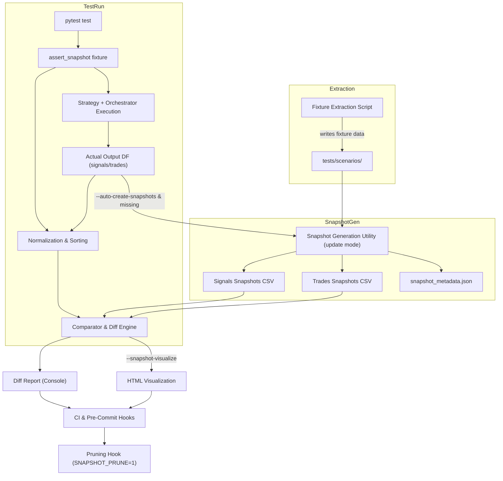

# Snapshot Testing Requirements for Strategy Lab

## 1. Purpose

Provide deterministic, reproducible tests ensuring that (a) strategy signal generation and (b) orchestrated trade order creation (strategy + risk management + orchestrator) remain stable over time for the same underlying historical data slice.

## 2. Scope

Included:

- Data fixture extraction from existing `data_cache` for specific trading days and tickers.
- Baseline snapshot generation of expected signals and trade orders.
- Test utilities to compare current outputs against stored snapshots.
- Integration into existing tests (e.g., `test_orb_indicator.py`, `test_orb_strategy.py`, orchestrator-related tests).
- Metadata and governance for snapshot updates.

Excluded (initial phase):

- Automatic adjustment for corporate actions (splits/dividends)—flagged as future enhancement.
- Live data mutation detection.
- Performance backtest metrics snapshots (only signals + trades for now).

## 3. Definitions

- Fixture Data: Curated subset of historical raw inputs copied from `data_cache` into `tests/scenarios/` for controlled testing.
- Snapshot: Canonical expected output (signals/trades) stored in versioned CSV/JSON plus a metadata sidecar describing context.
- Config Hash: Deterministic hash of strategy + risk + orchestrator relevant configuration to validate snapshot applicability.
- Update Mode: Explicit workflow (via env var or CLI flag) allowing regeneration of snapshots.

## 4. High-Level Guarantees

1. Given identical fixture data + configuration, strategy signal outputs are byte-for-byte identical (subject to tolerated numeric precision).
2. Given identical fixture data + configuration + strategy type + risk management type, orchestrator trade orders list is identical (same ordering, fields, and values).
3. Any divergence produces a concise diff explaining mismatches.
4. Snapshots cannot change silently—CI surfaces differences unless explicitly updated.

## 5. Data Fixture Extraction Script

Script Name: `scripts/extract_fixture_data.py` (TBD)
Path Resolution: All destination and source paths MUST be resolved via `resolve_workspace_path` from `src/utils/workspace.py` to ensure portability and consistency across environments.
Inputs:

- `--tickers T1 T2 ...`
- `--start-date YYYY-MM-DD`
- `--end-date YYYY-MM-DD` (inclusive, optional; if omitted equals start-date)
- `--source-path` (default: `data_cache` relative to workspace root)
- `--dest-path` (default: `tests/scenarios/<fixture_name>` resolved by `resolve_workspace_path`)
- `--fixture-name` (slug; auto-generated if omitted: e.g., `AAPL_NVDA_2025-11-07`)
  Outputs:
- Copied data files required by indicator/strategy (retain ALL columns for maximal regression coverage).
- `metadata.json` capturing: tickers, date range, row counts, created_at, generator version, commit hash.
  Requirements:
- Deterministic sorting of rows (timestamp ascending) prior to writing.
- Retain all available columns; optional column pruning may be added later if performance or size becomes problematic (current stance: completeness > minimalism).
- Validate data completeness (no missing essential columns).
- Fail fast if any ticker/date missing.

## 6. Snapshot Generation Mechanics

Primary mechanism: Pytest custom CLI flags drive snapshot creation and updates during test runs. A standalone script (`scripts/generate_snapshots.py`) is optional for bulk/CI operations but not required for normal workflow.

Pytest Flags (defined in `conftest.py` or plugin):

- `--auto-create-snapshots` – create missing snapshots for any test invoking `assert_snapshot`.
- `--update-snapshots` – overwrite existing snapshots with current outputs (baseline regeneration).
- `--snapshot-visualize` – emit HTML diff artifacts for mismatches.
- `--snapshot-prune` – after session, list (and optionally delete with confirmation) stale snapshot files not touched by any test.

Optional Script Inputs (if script retained):

- `--fixture <fixture_name>` or `--fixture-path`.
- `--strategies orb-strategy ...` (supports multiple).
- `--risk-profile <name>`.
- `--orchestrator-config <path>`.

Outputs:

- `signals__<fixture>__<strategy>__<test_context>.snapshot.csv`
- `trades__<fixture>__<strategy>__<risk_profile>__<test_context>.snapshot.csv`
- `snapshot_metadata.json` containing: commit, created_at, generator_version, config_hash, fixture_name, strategies, risk config summary, orchestrator settings.

## 7. Snapshot File Format

Primary storage: CSV (human diff friendly) + JSON sidecar metadata. Minimal viable snapshot format keeps precision while allowing stable diffs.
Naming Convention (one file per test case per strategy per fixture):

- Signals: `signals__<fixture>__<strategy>__<test_context>.snapshot.csv`
- Trades: `trades__<fixture>__<strategy>__<risk_profile>__<test_context>.snapshot.csv`

Test context (formerly `context_id` column) is embedded in the filename rather than a column, reducing per-row redundancy. If future multi-context aggregation is needed we can reintroduce a column.

Signals Columns (example): `timestamp,ticker,signal_type,strength`
Trades Columns (example): `timestamp,ticker,order_id,side,qty,price,reason`

Conventions:

- All timestamps ISO8601 UTC.
- Numeric fields normalized (round to 6 decimal places before writing).
- Sorted by: signals -> `timestamp,ticker,signal_type`; trades -> `timestamp,ticker,order_id`.
- No `strategy_run_id` column for now; if a future need arises to distinguish overlapping runs, we will add it with deterministic generation (e.g., hash of fixture+strategy+context).

## 8. Metadata & Hashing

Config Hash Inputs:

- Strategy parameters dict (sorted keys, JSON canonical form).
- Risk management parameters dict.
- Orchestrator relevant parameters (batch size, slippage model, etc.).
  Hash Algorithm: SHA256 over concatenated canonical JSON string.
  Purpose: On test load, verify stored `config_hash` matches newly computed; if mismatch -> instruct to regenerate snapshots.

## 9. Comparison Rules

Signals:

- Exact match in row count and ordering.
- For numeric columns: abs diff <= 1e-6.
- Fail on new/missing signal types.
  Trades:
- Exact match for categorical fields.
- Numeric tolerance on price/qty similar to signals.
  Diff Output:
- Summarize counts (expected vs actual).
- Show first N (e.g., 10) differing rows with side-by-side values.
- Provide hint: run snapshot update command if intentional.

## 10. Test Integration Strategy

Existing tests to augment:

- `test_orb_indicator.py`: After computing indicator-derived signals, compare to signals snapshot.
- `test_orb_strategy.py`: Run strategy core logic producing signal set; compare snapshot.
- Orchestrator test (new or augment existing): End-to-end (fixture -> strategy -> risk -> orders) -> compare trades snapshot.
  Fixtures: Use `pytest` parameterization over fixtures and strategies.
  Skip Conditions: If snapshot missing and not update mode -> fail with readable message.

## 11. Update Workflow

1. Developer changes logic.
2. Run tests normally: `pytest -k orb_strategy` -> potential FAIL with diff if behavior changed.
3. Review diff; if intentional regenerate: `pytest --update-snapshots -k orb_strategy` (overwrites affected snapshots).
4. Re-run without flag: `pytest -k orb_strategy` -> PASS.
5. Commit updated snapshots + metadata; CI runs without update flag and must PASS.

## 12. CI Governance & Pre-Commit Integration

- Pre-commit hook: runs `pytest --maxfail=1 -q` (or targeted subset) without snapshot flags; any diff fails commit.
- CI validation job: `pytest` (no update/auto-create flags) must pass; diffs cause failure.
- Optional regeneration job (manual trigger) can run `pytest --update-snapshots` then commit via PR if approved.
- HTML diff artifacts produced only if `--snapshot-visualize` specified in a diagnostic run.

## 13. Edge Cases & Considerations

Edge Cases:

- Missing day (holiday): script should skip or mark absent explicitly.
- Partial session: preserve partial data; no synthetic filler.
- Timezone shifts: all normalized to UTC.
- Floating point drift: minimize by rounding before snapshot creation.
- Non-deterministic elements (randomness, external latency): ensure seeded randomness or remove dependency.

## 14. Performance

- Keep fixtures minimal (one or two days, limited tickers) to reduce test runtime.
- Use lazy loading; do not recompute indicators repeatedly if cached within test scope.
- Provide an opt-in for expanded fixtures for stress tests (separate mark `@pytest.mark.slow`).

## 15. Security / Privacy

- Exclude credentials or tokens from fixture or snapshot metadata.
- Ensure no PII or secret keys end up in metadata or logs.

## 16. Future Extensions (Beyond Initial Scope)

- Multi-strategy aggregated portfolio snapshot.
- Metrics snapshot (win rate, expectancy) for regression detection.
- Compression of large fixtures.
- Parquet alternative for very large datasets (only if needed).

## 17. Risks

- Logic change causing cascading snapshot updates—mitigate via small, isolated fixtures.
- Floating point instability—mitigate via rounding.
- Hidden dependencies on environment—document all configuration inputs in metadata.

## 18. Acceptance Criteria

- Running test suite on main with no code changes yields PASS (stable snapshots).
- Introducing a deliberate logic change triggers clear snapshot diff failure.
- Setting UPDATE_SNAPSHOTS regenerates and then tests PASS.
- Snapshot metadata hashes validate configuration consistency.

## 19. Implementation Tracking

Implementation tasks have been moved to `snapshot_testing_todo.md` to keep this document focused on requirements and design. See that file for current status and IDs.

## 20. Open Questions

- Should snapshots be stored in `python/tests/snapshots/` vs adjacent to fixtures? (Leaning: `tests/snapshots/<fixture_name>/`.)
- Use JSON for metadata only or include Parquet alternative for large scale future? (Initial: CSV + JSON only.)
- Provide automatic fallback to update mode for new fixtures? (Probably no—explicitness preferred.)

## 21. Example Workflow (Developer)

1. Extract fixture: `python scripts/extract_fixture_data.py --tickers AAPL NVDA --start-date 2025-11-07 --fixture-name orb_smoke`
2. Initial baseline creation: `pytest --auto-create-snapshots -k orb_strategy` (writes missing snapshots).
3. Standard validation: `pytest -k orb_strategy` -> PASS.
4. Logic change: run `pytest -k orb_strategy` -> FAIL with diff.
5. Intentional change: `pytest --update-snapshots -k orb_strategy` regenerates affected snapshots.
6. Optional review with visualization: `pytest --snapshot-visualize -k orb_strategy` (if mismatches exist).
7. Prune stale: `pytest --snapshot-prune` (lists unused snapshots; optional removal flow).
8. Commit updated snapshots; CI (no flags) passes.

## 22. Minimal Contract Summaries

Data Extraction Script:

- Input: tickers[], date range
- Output: canonical fixture directory + metadata.json
- Errors: missing sources, empty data, unsupported ticker
  Snapshot Generation:
- Input: fixture, strategy config, risk config
- Output: signals/trades CSV + metadata
- Errors: fixture missing, config mismatch
  Comparison Helper:
- Input: expected CSV, actual DataFrame
- Output: pass/fail + diff summary
- Errors: schema mismatch, ordering mismatch

## 23. Edge Case Testing List

- Single ticker single day.
- Single ticker multi-day.
- Multi-ticker multi-day small range.
- Missing midday data (simulate).
- Price with high precision decimals.
- Strategy producing zero signals (expect empty snapshot test).

## 24. Diff Reporting Format (Proposed)

```
=== Signals Snapshot Diff (first 5 discrepancies) ===
RowIndex | Field | Expected | Actual | AbsDiff
42       | strength | 0.125000 | 0.125001 | 0.000001
...
Summary: 3 rows differ, 0 missing, 0 extra. Suggest: regenerate snapshots if intentional.
```

## 25. Maintenance Notes

- Bump `generator_version` when snapshot format changes.
- Document changes in CHANGELOG (future).
- Keep fixtures small; purge stale fixture directories quarterly.

---

This document is intended to evolve; adjust sections as implementation proceeds. Ensure TODO list stays synchronized with reality.

## 26. Architectural Diagram



Diagram Legend:

- Fixture Extraction produces stable input slice (fixture directory).
- Snapshot Generation writes CSV + metadata during update or auto-create flows.
- `assert_snapshot` pytest fixture orchestrates execution, normalization, comparison, auto-create, HTML rendering, pruning signaling.
- Comparator applies sorting, rounding, tolerance checks, and emits diff artifacts.
- Pytest CLI Flags: `--update-snapshots`, `--auto-create-snapshots`, `--snapshot-visualize`, `--snapshot-prune` govern optional behaviors.
- CI / Pre-Commit enforce snapshot stability and optionally perform pruning.
